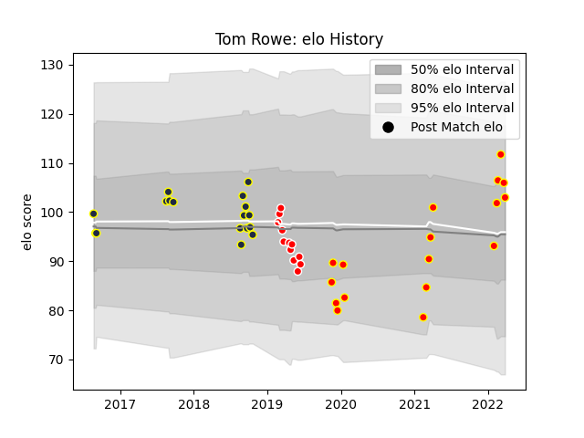

---  
layout: page  
title: Tom Rowe  
date: 2023-01-13 11:30:18.249668  
categories: player  
---
# Tom Rowe

## Positions: L

## Current elo: 82.0

## Current Percentile: 11.0

# Elo History

# Match History

| Team          |   Appearances |   Win Rate |
|:--------------|--------------:|-----------:|
| Kyuden Voltex |            18 |  0.333333  |
| Otago         |            16 |  0.6875    |
| Sunwolves     |            12 |  0.0833333 |

| Opponent                         |   Matches |   Win Rate |
|:---------------------------------|----------:|-----------:|
| Toyota Industries Shuttles Aichi |         4 |        0   |
| Chugoku Red Regulions            |         3 |        1   |
| Auckland                         |         2 |        1   |
| Queensland Reds                  |         2 |        0   |
| Manawatu                         |         2 |        1   |
| Bay of Plenty                    |         2 |        1   |
| Kurita Water Gush                |         2 |        0.5 |
| Northland                        |         2 |        1   |
| Hawke's Bay                      |         2 |        0.5 |
| Southland                        |         2 |        1   |
| Canterbury                       |         2 |        0   |
| Brumbies                         |         2 |        0   |
| Munakata Sanix Blues             |         2 |        0   |
| NTT Docomo Red Hurricanes Osaka  |         1 |        0   |
| Skyactivs Hiroshima              |         1 |        1   |
| Shimizu Blue Sharks              |         1 |        0   |
| Stormers                         |         1 |        0   |
| Tasman                           |         1 |        0   |
| New South Wales Waratahs         |         1 |        0   |
| Lions                            |         1 |        0   |
| Mazda Blue Zoomers               |         1 |        0   |
| Kamaishi Seawaves                |         1 |        1   |
| Jaguares                         |         1 |        0   |
| Hurricanes                       |         1 |        0   |
| Highlanders                      |         1 |        0   |
| Hanazono Kintetsu Liners         |         1 |        0   |
| Coca-Cola Red Sparks             |         1 |        0   |
| Chiefs                           |         1 |        1   |
| Blues                            |         1 |        0   |
| Wellington                       |         1 |        0   |