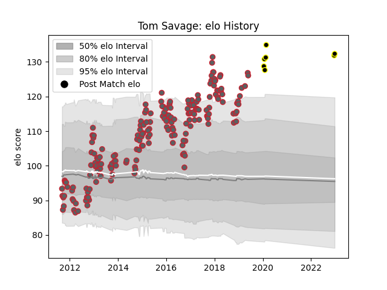

---  
layout: page  
title: Tom Savage  
date: 2023-01-13 11:32:54.934888  
categories: player  
---
# Tom Savage

## Positions: L, FL

## Current elo: 126.0

## Current Percentile: 94.0

# Elo History

# Match History

| Team             |   Appearances |   Win Rate |
|:-----------------|--------------:|-----------:|
| Gloucester Rugby |           191 |   0.528796 |
| Tokyo Sungoliath |             8 |   0.75     |

| Opponent                          |   Matches |   Win Rate |
|:----------------------------------|----------:|-----------:|
| Exeter Chiefs                     |        17 |   0.5      |
| Sale Sharks                       |        15 |   0.533333 |
| Northampton Saints                |        15 |   0.366667 |
| London Irish                      |        15 |   0.733333 |
| Leicester Tigers                  |        14 |   0.285714 |
| Harlequins                        |        14 |   0.321429 |
| Saracens                          |        13 |   0.307692 |
| Bath Rugby                        |        13 |   0.384615 |
| Worcester Warriors                |        12 |   0.666667 |
| Wasps                             |        12 |   0.291667 |
| Newcastle Falcons                 |        11 |   0.636364 |
| La Rochelle                       |         5 |   0.8      |
| London Welsh                      |         4 |   1        |
| Zebre                             |         4 |   1        |
| Green Rockets Tokatsu             |         2 |   1        |
| Castres Olympique                 |         2 |   0.5      |
| Bayonne                           |         2 |   1        |
| Benetton Treviso                  |         2 |   1        |
| Pau                               |         2 |   0        |
| Oyonnax                           |         2 |   1        |
| Brive                             |         2 |   1        |
| Bristol Rugby                     |         2 |   1        |
| Agen                              |         2 |   1        |
| Connacht                          |         2 |   1        |
| Biarritz Olympique                |         1 |   0        |
| Yokohama Canon Eagles             |         1 |   1        |
| Hino Red Dolphins                 |         1 |   1        |
| Kobelco Kobe Steelers             |         1 |   0        |
| Urayasu D-Rocks                   |         1 |   1        |
| Toyota Verblitz                   |         1 |   1        |
| Stade Francais Paris              |         1 |   0        |
| Cardiff Blues                     |         1 |   1        |
| Mont-de-Marsan                    |         1 |   1        |
| Perpignan                         |         1 |   1        |
| Kubota Spears Funabashi Tokyo-Bay |         1 |   0        |
| Dragons                           |         1 |   0        |
| Edinburgh                         |         1 |   1        |
| Munster                           |         1 |   0        |
| Bordeaux Begles                   |         1 |   1        |