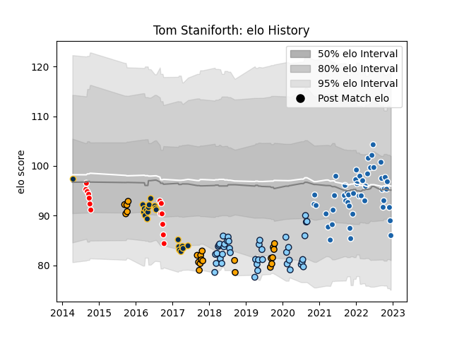

---  
layout: page  
title: Tom Staniforth  
date: 2022-12-14 11:19:35.876874  
categories: player  
---
# Tom Staniforth

## Positions: L

## Current elo: 86.0

## Current Percentile: 24.0

# Elo History

# Match History

| Team                     |   Appearances |   Win Rate |
|:-------------------------|--------------:|-----------:|
| Castres Olympique        |            48 |   0.645833 |
| New South Wales Waratahs |            41 |   0.426829 |
| NSW Country Eagles       |            22 |   0.5      |
| Brumbies                 |            21 |   0.52381  |
| Canberra Vikings         |            14 |   0.428571 |

| Opponent                 |   Matches |   Win Rate |
|:-------------------------|----------:|-----------:|
| Melbourne Rebels         |         9 |   0.666667 |
| Queensland Reds          |         7 |   0.857143 |
| Western Force            |         7 |   0.857143 |
| Melbourne Rising         |         6 |   0.333333 |
| Highlanders              |         6 |   0.333333 |
| Brumbies                 |         6 |   0.166667 |
| Stade Toulousain         |         5 |   0.7      |
| Queensland Country       |         5 |   0.4      |
| Bordeaux Begles          |         5 |   0.1      |
| Montpellier Herault      |         4 |   0.5      |
| La Rochelle              |         4 |   0.5      |
| Brive                    |         4 |   0.75     |
| Blues                    |         4 |   0        |
| Perth Spirit             |         4 |   0.5      |
| Pau                      |         4 |   1        |
| Lyon                     |         4 |   0.5      |
| Lions                    |         4 |   0.25     |
| Sunwolves                |         4 |   0.75     |
| Crusaders                |         4 |   0        |
| Clermont Auvergne        |         4 |   0.75     |
| Perpignan                |         3 |   0.666667 |
| Greater Sydney Rams      |         3 |   0.666667 |
| Brisbane City            |         3 |   0.5      |
| Chiefs                   |         3 |   0        |
| North Harbour Rays       |         3 |   0.5      |
| Sharks                   |         3 |   0.166667 |
| Toulon                   |         3 |   1        |
| Stormers                 |         2 |   0.5      |
| Stade Francais Paris     |         2 |   1        |
| Racing 92                |         2 |   0.5      |
| Sydney Stars             |         2 |   0.75     |
| Bulls                    |         2 |   0.5      |
| Canberra Vikings         |         2 |   0.5      |
| Fijian Drua              |         2 |   0.25     |
| NSW Country Eagles       |         2 |   0        |
| Sydney Rays              |         2 |   1        |
| Biarritz Olympique       |         2 |   1        |
| Cheetahs                 |         1 |   1        |
| New South Wales Waratahs |         1 |   1        |
| Jaguares                 |         1 |   0        |
| Exeter Chiefs            |         1 |   0        |
| Bayonne                  |         1 |   1        |