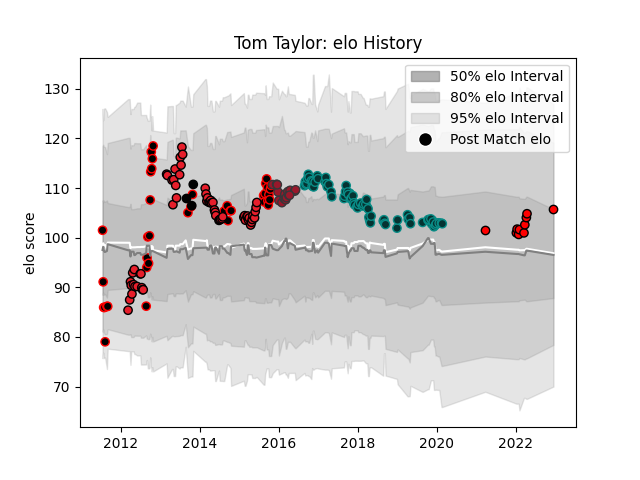

---  
layout: page  
title: Tom Taylor  
date: 2023-03-21 18:03:22.024904  
categories: player  
---
# Tom Taylor

Last updated: 2023-03-21
## Positions: FH, FB

## Country: New Zealand

## Current elo: 106.0

## Current Percentile: 68.0

# Elo History

# Match History

| Team                      |   Appearances |   Win Rate |
|:--------------------------|--------------:|-----------:|
| Pau                       |            72 |   0.465278 |
| Crusaders                 |            60 |   0.65     |
| Canterbury                |            39 |   0.820513 |
| Toulon                    |            16 |   0.6875   |
| Toshiba Brave Lupus Tokyo |            10 |   0.5      |
| New Zealand               |             3 |   1        |

| Opponent                          |   Matches |   Win Rate |
|:----------------------------------|----------:|-----------:|
| Chiefs                            |        10 |   0.3      |
| Bordeaux Begles                   |         8 |   0.5      |
| Hurricanes                        |         8 |   0.375    |
| Racing 92                         |         7 |   0.571429 |
| Brive                             |         7 |   0.714286 |
| Montpellier Herault               |         7 |   0.285714 |
| Clermont Auvergne                 |         7 |   0.285714 |
| Auckland                          |         6 |   1        |
| Toulon                            |         6 |   0.333333 |
| Stade Francais Paris              |         6 |   0.666667 |
| Blues                             |         6 |   0.666667 |
| Highlanders                       |         6 |   1        |
| La Rochelle                       |         5 |   0        |
| Lyon                              |         5 |   0.2      |
| Stade Toulousain                  |         5 |   0.2      |
| Taranaki                          |         5 |   0.6      |
| Castres Olympique                 |         4 |   0.75     |
| New South Wales Waratahs          |         4 |   0.5      |
| Tasman                            |         4 |   0.5      |
| Waikato                           |         4 |   0.75     |
| Wellington                        |         4 |   0.75     |
| Melbourne Rebels                  |         4 |   0.5      |
| Lions                             |         3 |   1        |
| Otago                             |         3 |   1        |
| North Harbour                     |         3 |   1        |
| Oyonnax                           |         3 |   1        |
| Queensland Reds                   |         3 |   1        |
| Sharks                            |         3 |   0.666667 |
| Southland                         |         3 |   0.666667 |
| Cardiff Blues                     |         3 |   0.333333 |
| Grenoble                          |         3 |   1        |
| Bayonne                           |         3 |   0.833333 |
| Cheetahs                          |         3 |   1        |
| Brumbies                          |         3 |   1        |
| Bulls                             |         3 |   0.333333 |
| Pau                               |         2 |   1        |
| Australia                         |         2 |   1        |
| Western Force                     |         2 |   1        |
| Stormers                          |         2 |   1        |
| Leinster                          |         2 |   1        |
| Counties Manukau                  |         2 |   1        |
| Hawke's Bay                       |         2 |   1        |
| Leicester Tigers                  |         2 |   0.5      |
| Toyota Verblitz                   |         2 |   0.5      |
| Tokyo Sungoliath                  |         1 |   0        |
| Urayasu D-Rocks                   |         1 |   0        |
| Agen                              |         1 |   0        |
| Shizuoka Blue Revs                |         1 |   1        |
| Saitama Wild Knights              |         1 |   0        |
| Northland                         |         1 |   1        |
| NTT Docomo Red Hurricanes Osaka   |         1 |   1        |
| Manawatu                          |         1 |   1        |
| Kubota Spears Funabashi Tokyo-Bay |         1 |   0        |
| Kobelco Kobe Steelers             |         1 |   1        |
| Japan                             |         1 |   1        |
| Calvisano                         |         1 |   1        |
| Black Rams Tokyo                  |         1 |   1        |
| Bay of Plenty                     |         1 |   1        |
| Zebre                             |         1 |   1        |