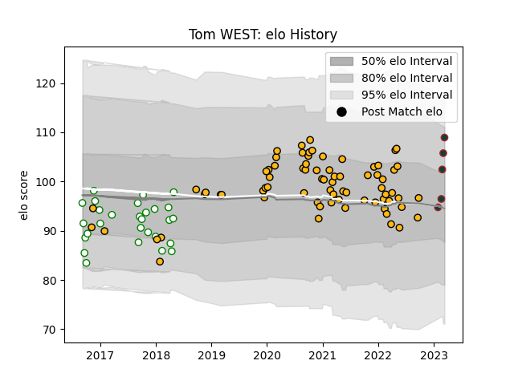

---  
layout: page  
title: Tom WEST  
date: 2023-01-31 16:07:52.126955  
categories: player  
---
# Tom WEST

## Positions: P

## Current elo: 102.0

## Current Percentile: 65.0

# Elo History

# Match History

| Team       |   Appearances |   Win Rate |
|:-----------|--------------:|-----------:|
| Wasps      |            70 |   0.492857 |
| Nottingham |            28 |   0.410714 |

| Opponent            |   Matches |   Win Rate |
|:--------------------|----------:|-----------:|
| Bristol Rugby       |         9 |   0.555556 |
| London Irish        |         7 |   0.5      |
| Exeter Chiefs       |         6 |   0.5      |
| Worcester Warriors  |         6 |   0.833333 |
| Sale Sharks         |         6 |   0.333333 |
| Newcastle Falcons   |         5 |   0.4      |
| Leicester Tigers    |         5 |   0.4      |
| Bath Rugby          |         5 |   1        |
| Northampton Saints  |         5 |   0.2      |
| Gloucester Rugby    |         4 |   0.5      |
| Harlequins          |         4 |   0.25     |
| Saracens            |         4 |   0.5      |
| Yorkshire Carnegie  |         4 |   0        |
| Rotherham Titans    |         3 |   0.833333 |
| Ealing Trailfinders |         3 |   0.333333 |
| Cornish Pirates     |         3 |   0.333333 |
| London Scottish     |         3 |   0.666667 |
| Richmond            |         2 |   1        |
| Jersey              |         2 |   0.5      |
| Munster             |         2 |   0        |
| Hartpury College    |         2 |   0.5      |
| Edinburgh           |         2 |   0        |
| Doncaster           |         2 |   0        |
| Bedford             |         2 |   0.5      |
| Bordeaux Begles     |         1 |   0        |
| Agen                |         1 |   1        |