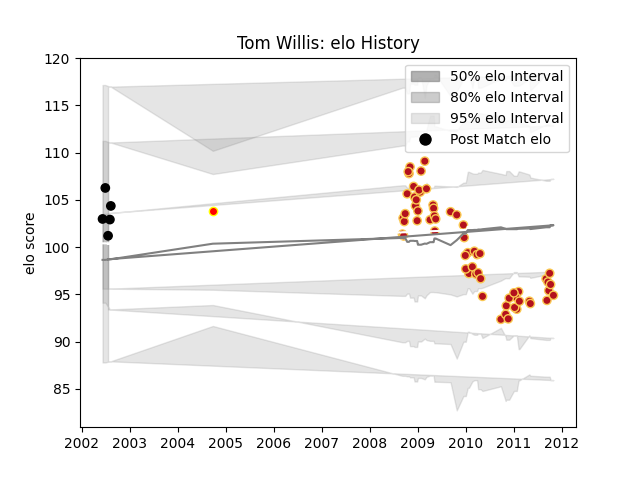

---  
layout: page  
title: Tom Willis  
date: 2022-12-09 13:24:04.399126  
categories: player  
---
# Tom Willis

## Positions: H

## Country: New Zealand

## Current elo: 97.0

## Current Percentile: 54.0

# Elo History

# Match History

| Team        |   Appearances |   Win Rate |
|:------------|--------------:|-----------:|
| Dragons     |            62 |   0.346774 |
| New Zealand |             4 |   0.75     |
| Waikato     |             1 |   0        |

| Opponent           |   Matches |   Win Rate |
|:-------------------|----------:|-----------:|
| Glasgow Warriors   |         8 |   0.25     |
| Scarlets           |         7 |   0.142857 |
| Ulster             |         6 |   0.75     |
| Munster            |         5 |   0.4      |
| Cardiff Blues      |         5 |   0.2      |
| Connacht           |         5 |   0.4      |
| Ospreys            |         5 |   0.6      |
| Edinburgh          |         4 |   0.75     |
| Leinster           |         4 |   0.25     |
| Stade Toulousain   |         3 |   0        |
| Gloucester Rugby   |         3 |   0.333333 |
| Bath Rugby         |         2 |   0        |
| Biarritz Olympique |         2 |   0        |
| South Africa       |         1 |   1        |
| Aironi             |         1 |   1        |
| Italy              |         1 |   1        |
| Australia          |         1 |   0        |
| Fiji               |         1 |   1        |
| Canterbury         |         1 |   0        |
| Benetton Treviso   |         1 |   0        |
| Wasps              |         1 |   0        |