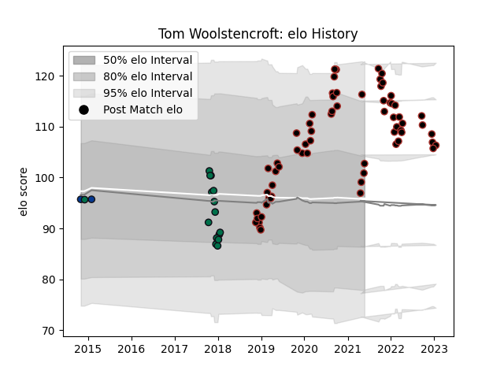

---  
layout: page  
title: Tom Woolstencroft  
date: 2023-01-17 11:33:59.114170  
categories: player  
---
# Tom Woolstencroft

## Positions: H

## Current elo: 103.0

## Current Percentile: 90.0

# Elo History

# Match History

| Team         |   Appearances |   Win Rate |
|:-------------|--------------:|-----------:|
| Saracens     |            68 |       0.75 |
| London Irish |            15 |       0.2  |
| Bath Rugby   |             2 |       1    |

| Opponent             |   Matches |   Win Rate |
|:---------------------|----------:|-----------:|
| Leicester Tigers     |         7 |   0.714286 |
| Harlequins           |         7 |   0.857143 |
| Gloucester Rugby     |         7 |   0.285714 |
| London Irish         |         6 |   0.583333 |
| Worcester Warriors   |         5 |   0.4      |
| Wasps                |         5 |   0.4      |
| Bath Rugby           |         5 |   0.5      |
| Sale Sharks          |         5 |   0.6      |
| Exeter Chiefs        |         4 |   0.75     |
| Newcastle Falcons    |         4 |   0.75     |
| Northampton Saints   |         3 |   1        |
| Edinburgh            |         3 |   0.333333 |
| Bristol Rugby        |         3 |   0.666667 |
| Krasny Yar           |         2 |   1        |
| Stade Francais Paris |         2 |   0.5      |
| Cardiff Blues        |         2 |   1        |
| Lyon                 |         2 |   1        |
| Saracens             |         1 |   0        |
| Ospreys              |         1 |   1        |
| Nottingham           |         1 |   1        |
| Racing 92            |         1 |   0        |
| Ampthill             |         1 |   1        |
| Munster              |         1 |   1        |
| London Welsh         |         1 |   1        |
| Glasgow Warriors     |         1 |   1        |
| Ealing Trailfinders  |         1 |   1        |
| Doncaster            |         1 |   1        |
| Coventry             |         1 |   1        |
| Brive                |         1 |   1        |
| Leinster             |         1 |   1        |