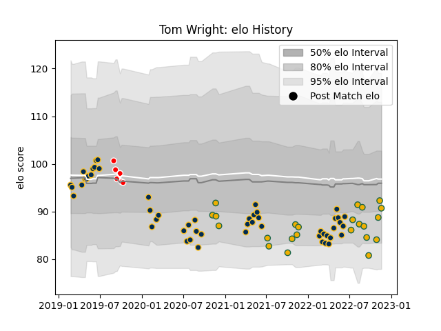

---  
layout: page  
title: Tom Wright  
date: 2023-03-17 17:39:33.355826  
categories: player  
---
# Tom Wright

## Positions: W, FB

## Country: Australia

## Current elo: 99.0

## Current Percentile: 62.0

# Elo History

# Match History

| Team             |   Appearances |   Win Rate |
|:-----------------|--------------:|-----------:|
| Brumbies         |            56 |   0.696429 |
| Australia        |            25 |   0.42     |
| Canberra Vikings |             8 |   0.75     |

| Opponent                 |   Matches |   Win Rate |
|:-------------------------|----------:|-----------:|
| Queensland Reds          |        10 |   0.6      |
| Argentina                |         7 |   0.642857 |
| New South Wales Waratahs |         7 |   1        |
| Western Force            |         6 |   0.833333 |
| Melbourne Rebels         |         5 |   0.8      |
| Blues                    |         5 |   0.4      |
| Hurricanes               |         4 |   0.75     |
| Fijian Drua              |         4 |   1        |
| Sunwolves                |         3 |   1        |
| New Zealand              |         3 |   0.333333 |
| Chiefs                   |         3 |   0.666667 |
| France                   |         3 |   0.333333 |
| Highlanders              |         3 |   0.333333 |
| England                  |         3 |   0        |
| Jaguares                 |         2 |   0        |
| Wales                    |         2 |   0.5      |
| Crusaders                |         2 |   0        |
| South Africa             |         2 |   0.5      |
| Scotland                 |         2 |   0.5      |
| Brisbane City            |         1 |   1        |
| Sydney Rays              |         1 |   1        |
| Stormers                 |         1 |   1        |
| Sharks                   |         1 |   1        |
| Ireland                  |         1 |   0        |
| Queensland Country       |         1 |   0        |
| Italy                    |         1 |   0        |
| Bulls                    |         1 |   1        |
| NSW Country Eagles       |         1 |   1        |
| Melbourne Rising         |         1 |   1        |
| Lions                    |         1 |   1        |
| Japan                    |         1 |   1        |
| Moana Pasifika           |         1 |   0        |