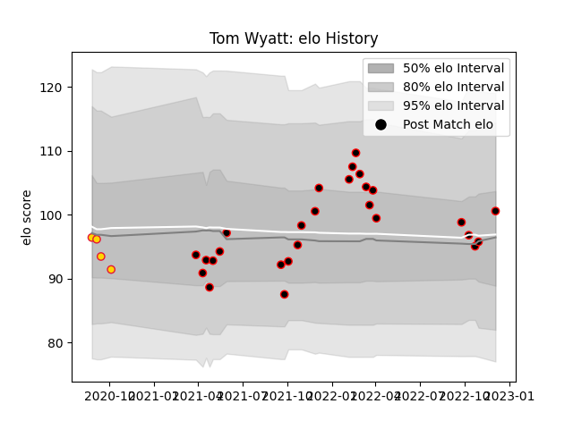

---  
layout: page  
title: Tom Wyatt  
date: 2022-12-12 15:05:03.998579  
categories: player  
---
# Tom Wyatt

## Positions: C, W

## Current elo: 101.0

## Current Percentile: 46.0

# Elo History

# Match History

| Team            |   Appearances |   Win Rate |
|:----------------|--------------:|-----------:|
| Cornish Pirates |            27 |   0.555556 |
| Exeter Chiefs   |             4 |   0.5      |

| Opponent            |   Matches |   Win Rate |
|:--------------------|----------:|-----------:|
| Ealing Trailfinders |         4 |   0.25     |
| Ampthill            |         3 |   0.5      |
| Coventry            |         3 |   0.666667 |
| Doncaster           |         3 |   0.333333 |
| Hartpury College    |         3 |   0.666667 |
| Jersey              |         3 |   0.333333 |
| Bedford             |         2 |   0.5      |
| London Scottish     |         2 |   1        |
| Nottingham          |         2 |   1        |
| Richmond            |         2 |   0.75     |
| Bristol Rugby       |         1 |   1        |
| Northampton Saints  |         1 |   1        |
| Saracens            |         1 |   0        |
| Wasps               |         1 |   0        |