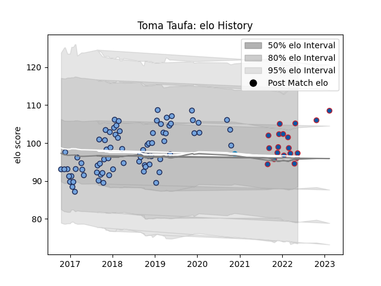

---  
layout: page  
title: Toma Taufa  
date: 2023-02-15 22:12:40.490553  
categories: player  
---
# Toma Taufa

## Positions: P

## Current elo: 97.0

## Current Percentile: 77.0

# Elo History

# Match History

| Team                |   Appearances |   Win Rate |
|:--------------------|--------------:|-----------:|
| Bayonne             |            77 |   0.525974 |
| Grenoble            |            19 |   0.552632 |
| Montpellier Herault |             1 |   0        |

| Opponent             |   Matches |   Win Rate |
|:---------------------|----------:|-----------:|
| Carcassonne          |         6 |   0.5      |
| Montauban            |         6 |   0.75     |
| Mont-de-Marsan       |         6 |   0.416667 |
| Vannes               |         5 |   0.6      |
| Beziers              |         5 |   0.4      |
| Nevers               |         5 |   0.7      |
| Colomiers            |         5 |   0.6      |
| Aurillac             |         4 |   1        |
| Biarritz Olympique   |         4 |   0        |
| Brive                |         4 |   0.75     |
| Oyonnax              |         4 |   0.5      |
| US Bressane          |         3 |   1        |
| Soyaux-Angouleme     |         3 |   0.666667 |
| Narbonne             |         3 |   0.833333 |
| Massy                |         3 |   1        |
| La Rochelle          |         3 |   0        |
| Clermont Auvergne    |         3 |   0.666667 |
| London Irish         |         2 |   0.5      |
| Dax                  |         2 |   0.75     |
| Toulon               |         2 |   0        |
| Stade Toulousain     |         2 |   0.5      |
| Perpignan            |         2 |   0        |
| Gloucester Rugby     |         2 |   0        |
| Grenoble             |         2 |   0.5      |
| Montpellier Herault  |         1 |   0        |
| Castres Olympique    |         1 |   0        |
| Pau                  |         1 |   0.5      |
| Lyon                 |         1 |   0        |
| Provence Rugby       |         1 |   1        |
| Racing 92            |         1 |   0        |
| Rouen                |         1 |   1        |
| Benetton Treviso     |         1 |   0        |
| Stade Francais Paris |         1 |   0        |
| Bayonne              |         1 |   0        |
| Agen                 |         1 |   1        |