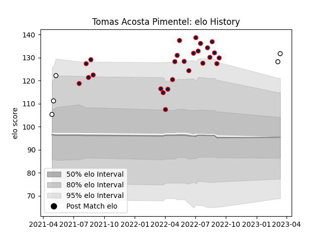

---  
layout: page  
title: Tomas Acosta Pimentel  
date: 2023-03-09 10:11:27.278669  
categories: player  
---
# Tomas Acosta Pimentel

## Positions: W, C

## Current elo: 128.0

## Current Percentile: 97.0

# Elo History

# Match History

| Team          |   Appearances |   Win Rate |
|:--------------|--------------:|-----------:|
| Buenos Aires  |            26 |   0.25     |
| Olimpia Lions |             3 |   0.333333 |
| Yacare XV     |             1 |   1        |

| Opponent             |   Matches |   Win Rate |
|:---------------------|----------:|-----------:|
| CUBA                 |         3 |   0        |
| Hindu                |         3 |   0        |
| Los Tilos            |         3 |   0.666667 |
| Pucara               |         3 |   0.333333 |
| Alumni               |         2 |   0        |
| Atlético del Rosario |         2 |   0.5      |
| Belgrano             |         2 |   0.25     |
| Jaguares XV          |         2 |   0        |
| Newman               |         2 |   0        |
| Regatas Bella Vista  |         2 |   0        |
| SIC                  |         2 |   0        |
| CASI                 |         1 |   1        |
| Cafeteros Pro        |         1 |   1        |
| Cobras               |         1 |   1        |
| San Luis             |         1 |   1        |