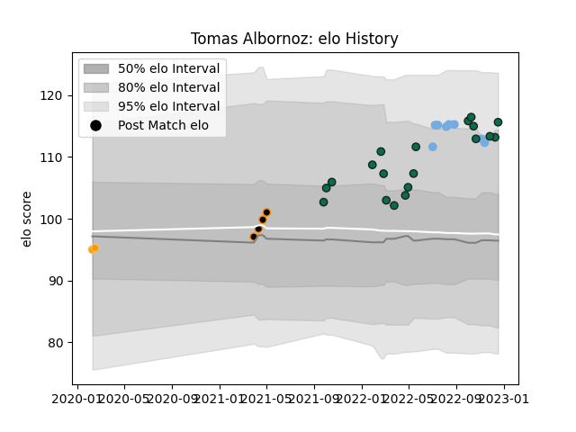

---  
layout: page  
title: Tomas Albornoz  
date: 2023-01-06 00:24:27.097250  
categories: player  
---
# Tomas Albornoz

## Positions: FH

## Country: Argentina

## Current elo: 107.0

## Current Percentile: 55.0

# Elo History

# Match History

| Team             |   Appearances |   Win Rate |
|:-----------------|--------------:|-----------:|
| Benetton Treviso |            21 |       0.5  |
| Argentina        |             8 |       0.75 |
| Jaguares XV      |             7 |       1    |
| Ceibos Rugby     |             2 |       1    |
| Jaguares         |             2 |       0.5  |

| Opponent             |   Matches |   Win Rate |
|:---------------------|----------:|-----------:|
| Zebre                |         3 |   1        |
| Selknam              |         3 |   1        |
| Edinburgh            |         3 |   0.666667 |
| Dragons              |         2 |   0.75     |
| Penarol Rugby        |         2 |   1        |
| Olimpia Lions        |         2 |   1        |
| Australia            |         2 |   0.5      |
| Bulls                |         2 |   0        |
| Cobras               |         1 |   1        |
| England              |         1 |   1        |
| Wales                |         1 |   0        |
| Stormers             |         1 |   1        |
| Stade Francais Paris |         1 |   0        |
| Sharks               |         1 |   0        |
| Scotland             |         1 |   1        |
| Scarlets             |         1 |   1        |
| Queensland Reds      |         1 |   1        |
| Portugal             |         1 |   1        |
| Cafeteros Pro        |         1 |   1        |
| Ospreys              |         1 |   0        |
| Cardiff Blues        |         1 |   1        |
| New Zealand          |         1 |   1        |
| Bayonne              |         1 |   1        |
| Lions                |         1 |   0        |
| Leinster             |         1 |   0        |
| Hurricanes           |         1 |   0        |
| Glasgow Warriors     |         1 |   0        |
| Georgia              |         1 |   1        |
| Munster              |         1 |   0        |