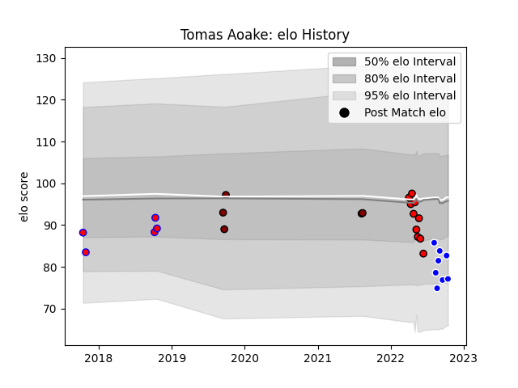

---  
layout: page  
title: Tomas Aoake  
date: 2023-03-02 11:24:48.827761  
categories: player  
---
# Tomas Aoake

## Positions: W

## Current elo: 77.0

## Current Percentile: 17.0

# Elo History

# Match History

| Team             |   Appearances |   Win Rate |
|:-----------------|--------------:|-----------:|
| San Diego Legion |            10 |      0.4   |
| Auckland         |             8 |      0.625 |
| North Harbour    |             5 |      0.4   |
| Tasman           |             5 |      0.4   |

| Opponent          |   Matches |   Win Rate |
|:------------------|----------:|-----------:|
| Otago             |         3 |   0.666667 |
| Austin Gilgronis  |         2 |   0        |
| Tasman            |         2 |   0.5      |
| Seattle Seawolves |         2 |   0        |
| North Harbour     |         2 |   1        |
| Counties Manukau  |         2 |   0.5      |
| Canterbury        |         2 |   0        |
| Hawke's Bay       |         1 |   1        |
| Houston SaberCats |         1 |   0        |
| L. A. Giltinis    |         1 |   1        |
| Manawatu          |         1 |   1        |
| NOLA Gold         |         1 |   1        |
| Bay of Plenty     |         1 |   0        |
| Northland         |         1 |   0        |
| Dallas Jackals    |         1 |   1        |
| Rugby ATL         |         1 |   0        |
| Southland         |         1 |   1        |
| Utah Warriors     |         1 |   1        |
| Waikato           |         1 |   0        |
| Wellington        |         1 |   0        |