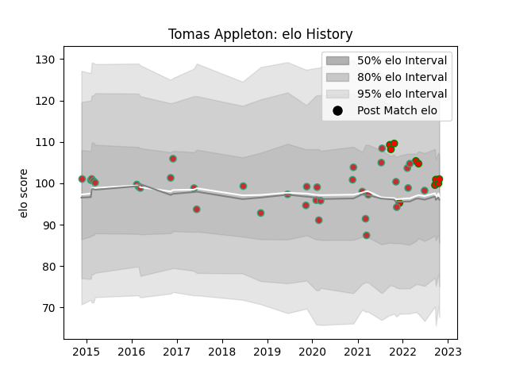

---  
layout: page  
title: Tomas Appleton  
date: 2023-03-21 17:57:22.677756  
categories: player  
---
# Tomas Appleton

Last updated: 2023-03-21
## Positions: C, FH

## Country: Portugal

## Current elo: 101.0

## Current Percentile: 58.0

# Elo History

# Match History

| Team         |   Appearances |   Win Rate |
|:-------------|--------------:|-----------:|
| Portugal     |            35 |   0.442857 |
| Lusitanos XV |            10 |   0.8      |

| Opponent                 |   Matches |   Win Rate |
|:-------------------------|----------:|-----------:|
| Georgia                  |         5 |   0.1      |
| Brazil                   |         5 |   0.6      |
| Romania                  |         5 |   0.2      |
| Germany                  |         4 |   0.5      |
| Spain                    |         4 |   0.25     |
| Castilla y Leon Iberians |         4 |   0.75     |
| Belgium                  |         3 |   0.666667 |
| Brussels Devils          |         3 |   1        |
| Netherlands              |         2 |   1        |
| Russia                   |         2 |   0.5      |
| Delta                    |         1 |   1        |
| Chile                    |         1 |   1        |
| Black Lion               |         1 |   0        |
| Italy                    |         1 |   0        |
| Japan                    |         1 |   0        |
| Namibia                  |         1 |   1        |
| Canada                   |         1 |   1        |
| Tel-Aviv Heat            |         1 |   1        |