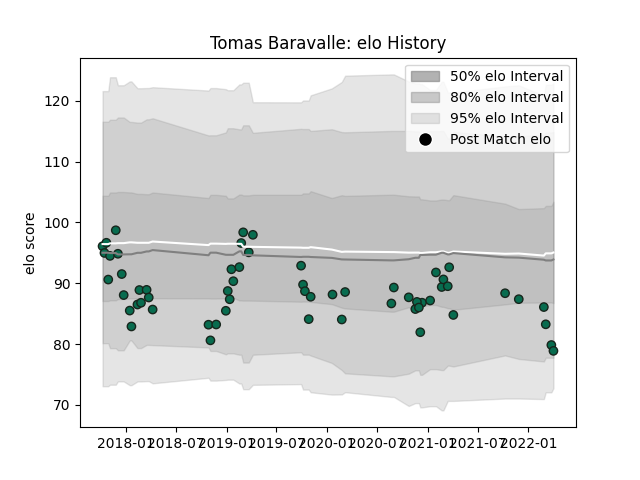

---  
layout: page  
title: Tomas Baravalle  
date: 2023-03-21 18:38:44.708064  
categories: player  
---
# Tomas Baravalle

Last updated: 2023-03-21
## Positions: H

## Current elo: 79.0

## Current Percentile: 13.0

# Elo History

# Match History

| Team             |   Appearances |   Win Rate |
|:-----------------|--------------:|-----------:|
| Benetton Treviso |            59 |   0.355932 |

| Opponent             |   Matches |   Win Rate |
|:---------------------|----------:|-----------:|
| Leinster             |         6 |  0.0833333 |
| Connacht             |         6 |  0         |
| Scarlets             |         6 |  0.333333  |
| Dragons              |         5 |  0.8       |
| Zebre                |         5 |  0.6       |
| Cardiff Blues        |         4 |  0         |
| Ulster               |         4 |  0.125     |
| Edinburgh            |         3 |  0.666667  |
| Munster              |         3 |  0         |
| Southern Kings       |         3 |  1         |
| Glasgow Warriors     |         2 |  1         |
| Bath Rugby           |         2 |  0         |
| Ospreys              |         2 |  0         |
| Toulon               |         2 |  0         |
| Agen                 |         2 |  1         |
| Cheetahs             |         1 |  0         |
| Grenoble             |         1 |  1         |
| Sharks               |         1 |  0         |
| Stade Francais Paris |         1 |  1         |