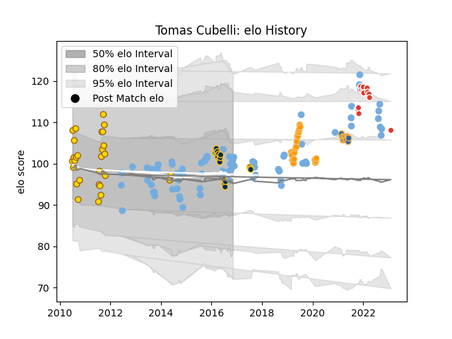

---  
layout: page  
title: Tomas Cubelli  
date: 2023-02-04 18:27:18.047187  
categories: player  
---
# Tomas Cubelli

## Positions: SH

## Country: Argentina

## Current elo: 101.0

## Current Percentile: 64.0

# Elo History

# Match History

| Team               |   Appearances |   Win Rate |
|:-------------------|--------------:|-----------:|
| Argentina          |            82 |   0.29878  |
| Belgrano           |            28 |   0.642857 |
| Jaguares           |            22 |   0.681818 |
| Brumbies           |            18 |   0.5      |
| Biarritz Olympique |            14 |   0.214286 |
| Western Force      |            13 |   0.307692 |

| Opponent                 |   Matches |   Win Rate |
|:-------------------------|----------:|-----------:|
| New Zealand              |        16 |   0.125    |
| South Africa             |        16 |   0.1875   |
| Australia                |        13 |   0.153846 |
| France                   |         9 |   0.333333 |
| Queensland Reds          |         6 |   0.666667 |
| Italy                    |         5 |   1        |
| New South Wales Waratahs |         5 |   1        |
| Brumbies                 |         5 |   0.4      |
| Ireland                  |         5 |   0.2      |
| Hurricanes               |         5 |   0.4      |
| Chiefs                   |         5 |   0.2      |
| Wales                    |         4 |   0.375    |
| Stormers                 |         4 |   0.25     |
| Highlanders              |         4 |   0        |
| England                  |         4 |   0        |
| SIC                      |         3 |   0.333333 |
| Crusaders                |         3 |   0        |
| Melbourne Rebels         |         3 |   0.666667 |
| Pucara                   |         3 |   0.333333 |
| Bulls                    |         3 |   1        |
| Scotland                 |         3 |   0        |
| Olivos                   |         2 |   1        |
| Newman                   |         2 |   1        |
| Alumni                   |         2 |   0        |
| San Luis                 |         2 |   1        |
| Sharks                   |         2 |   1        |
| Tonga                    |         2 |   1        |
| Toulon                   |         2 |   0        |
| Montpellier Herault      |         2 |   0        |
| Lyon                     |         2 |   0        |
| Western Force            |         2 |   1        |
| Blues                    |         2 |   0.5      |
| Lions                    |         2 |   0.5      |
| La Plata                 |         2 |   0.75     |
| CASI                     |         2 |   0.5      |
| Hindu                    |         2 |   0        |
| Georgia                  |         2 |   1        |
| Champagnat               |         2 |   1        |
| Cheetahs                 |         1 |   1        |
| Vannes                   |         1 |   1        |
| Bordeaux Begles          |         1 |   0        |
| Brive                    |         1 |   1        |
| Sunwolves                |         1 |   1        |
| Stade Francais Paris     |         1 |   1        |
| Castres Olympique        |         1 |   0        |
| Manuel Belgrano          |         1 |   1        |
| San Martin               |         1 |   1        |
| Clermont Auvergne        |         1 |   0        |
| Atlético del Rosario     |         1 |   0.5      |
| Romania                  |         1 |   1        |
| Japan                    |         1 |   1        |
| Perpignan                |         1 |   0        |
| Pau                      |         1 |   0        |
| Liceo Naval              |         1 |   1        |
| Lomas                    |         1 |   1        |
| Namibia                  |         1 |   1        |
| San Albano               |         1 |   1        |