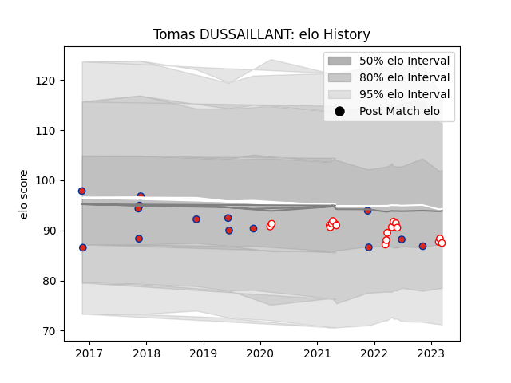

---  
layout: page  
title: Tomas DUSSAILLANT  
date: 2023-03-06 11:23:20.614925  
categories: player  
---
# Tomas DUSSAILLANT

## Positions: H

## Country: Chile

## Current elo: 88.0

## Current Percentile: 26.0

# Elo History

# Match History

| Team    |   Appearances |   Win Rate |
|:--------|--------------:|-----------:|
| Selknam |            17 |   0.705882 |
| Chile   |            14 |   0.357143 |

| Opponent          |   Matches |   Win Rate |
|:------------------|----------:|-----------:|
| Jaguares XV       |         4 |   0.75     |
| Cobras            |         3 |   0.666667 |
| Russia            |         3 |   0.666667 |
| Penarol Rugby     |         3 |   0.666667 |
| Olimpia Lions     |         3 |   0.666667 |
| Romania           |         2 |   0        |
| Korea             |         2 |   0.5      |
| American Raptors  |         1 |   1        |
| Pampas XV         |         1 |   1        |
| Scotland          |         1 |   0        |
| Portugal          |         1 |   0        |
| New Zealand Maori |         1 |   0        |
| Cafeteros Pro     |         1 |   1        |
| Kenya             |         1 |   1        |
| Hong Kong         |         1 |   0        |
| Germany           |         1 |   1        |
| Ceibos Rugby      |         1 |   0        |
| Spain             |         1 |   0        |