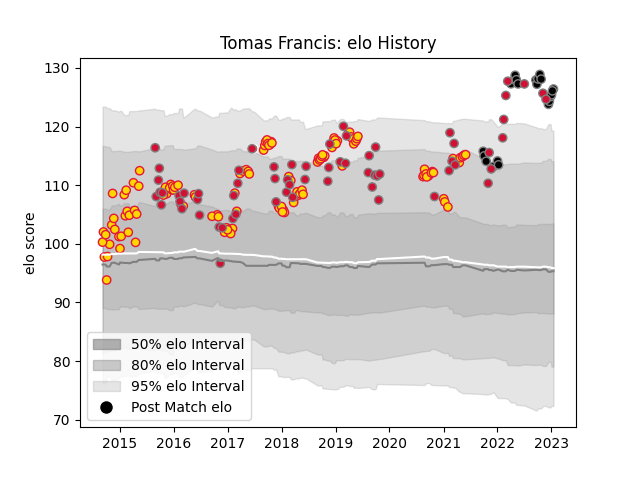

---  
layout: page  
title: Tomas Francis  
date: 2023-01-06 00:13:22.277232  
categories: player  
---
# Tomas Francis

## Positions: P

## Country: Wales

## Current elo: 130.0

## Current Percentile: 98.0

# Elo History

# Match History

| Team                    |   Appearances |   Win Rate |
|:------------------------|--------------:|-----------:|
| Exeter Chiefs           |           122 |   0.717213 |
| Wales                   |            64 |   0.570312 |
| Ospreys                 |            20 |   0.6      |
| British and Irish Lions |             2 |   0.75     |

| Opponent            |   Matches |   Win Rate |
|:--------------------|----------:|-----------:|
| Wasps               |        13 |   0.692308 |
| Leicester Tigers    |        11 |   0.636364 |
| Gloucester Rugby    |        11 |   0.545455 |
| Bath Rugby          |        10 |   0.8      |
| Saracens            |        10 |   0.5      |
| England             |         9 |   0.444444 |
| Newcastle Falcons   |         9 |   0.777778 |
| Ireland             |         8 |   0.5625   |
| Northampton Saints  |         8 |   0.75     |
| Sale Sharks         |         7 |   1        |
| London Irish        |         7 |   0.857143 |
| Australia           |         7 |   0.428571 |
| Scotland            |         7 |   0.714286 |
| France              |         7 |   0.571429 |
| New Zealand         |         6 |   0        |
| South Africa        |         6 |   0.333333 |
| Harlequins          |         6 |   1        |
| Worcester Warriors  |         6 |   1        |
| Glasgow Warriors    |         4 |   0.5      |
| Bristol Rugby       |         4 |   0.75     |
| Scarlets            |         4 |   0.625    |
| Italy               |         4 |   1        |
| Dragons             |         4 |   0.75     |
| Montpellier Herault |         3 |   1        |
| Cardiff Blues       |         3 |   1        |
| Clermont Auvergne   |         3 |   0.333333 |
| Argentina           |         3 |   1        |
| London Welsh        |         2 |   1        |
| Leinster            |         2 |   0        |
| Ulster              |         2 |   0.5      |
| Tonga               |         2 |   1        |
| Stormers            |         2 |   0.25     |
| Fiji                |         2 |   1        |
| Georgia             |         2 |   1        |
| Castres Olympique   |         2 |   0.5      |
| Ospreys             |         1 |   0        |
| Racing 92           |         1 |   1        |
| Bulls               |         1 |   0        |
| Connacht            |         1 |   1        |
| Hurricanes          |         1 |   0.5      |
| Bordeaux Begles     |         1 |   0        |
| Stade Toulousain    |         1 |   1        |
| Chiefs              |         1 |   1        |
| Lions               |         1 |   0        |
| Munster             |         1 |   0.5      |
| Uruguay             |         1 |   1        |
| Benetton Treviso    |         1 |   1        |