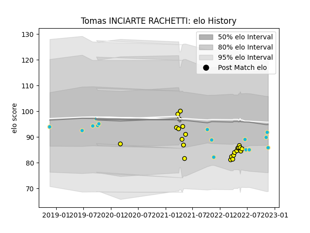

---  
layout: page  
title: Tomas INCIARTE RACHETTI  
date: 2023-02-28 11:07:13.274321  
categories: player  
---
# Tomas INCIARTE RACHETTI

## Positions: SH, C

## Country: Uruguay

## Current elo: 86.0

## Current Percentile: 39.0

# Elo History

# Match History

| Team          |   Appearances |   Win Rate |
|:--------------|--------------:|-----------:|
| Penarol Rugby |            23 |   0.695652 |
| Uruguay       |            15 |   0.333333 |

| Opponent                 |   Matches |   Win Rate |
|:-------------------------|----------:|-----------:|
| Selknam                  |         7 |   0.571429 |
| Cafeteros Pro            |         5 |   1        |
| Jaguares XV              |         5 |   0.4      |
| Olimpia Lions            |         4 |   0.75     |
| Romania                  |         3 |   0.666667 |
| Cobras                   |         2 |   1        |
| Fiji                     |         2 |   0.5      |
| Japan                    |         2 |   0        |
| Australia                |         1 |   0        |
| Brazil                   |         1 |   1        |
| Georgia                  |         1 |   0        |
| Italy                    |         1 |   0        |
| Spain                    |         1 |   0        |
| Tonga                    |         1 |   0        |
| United States of America |         1 |   1        |
| Wales                    |         1 |   0        |