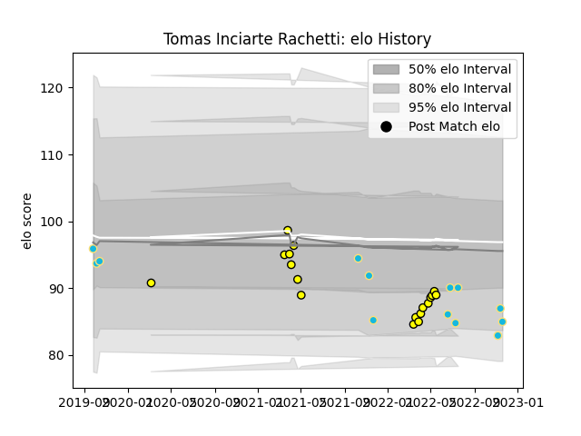

---  
layout: page  
title: Tomas Inciarte Rachetti  
date: 2022-11-16 11:22:50.395581  
categories: player  
---
# Tomas Inciarte Rachetti

## Positions: SH, C

## Country: Uruguay

## Current elo: 86.0

## Current Percentile: 25.0

# Elo History

# Match History

| Team          |   Appearances |   Win Rate |
|:--------------|--------------:|-----------:|
| Penarol Rugby |            18 |   0.722222 |
| Uruguay       |            12 |   0.333333 |

| Opponent                 |   Matches |   Win Rate |
|:-------------------------|----------:|-----------:|
| Cafeteros Pro            |         4 |       1    |
| Jaguares XV              |         4 |       0.5  |
| Olimpia Lions            |         4 |       0.75 |
| Romania                  |         4 |       0.5  |
| Selknam                  |         4 |       0.5  |
| Cobras                   |         2 |       1    |
| Japan                    |         2 |       0    |
| Australia                |         1 |       0    |
| Fiji                     |         1 |       1    |
| Georgia                  |         1 |       0    |
| Italy                    |         1 |       0    |
| United States of America |         1 |       1    |
| Wales                    |         1 |       0    |