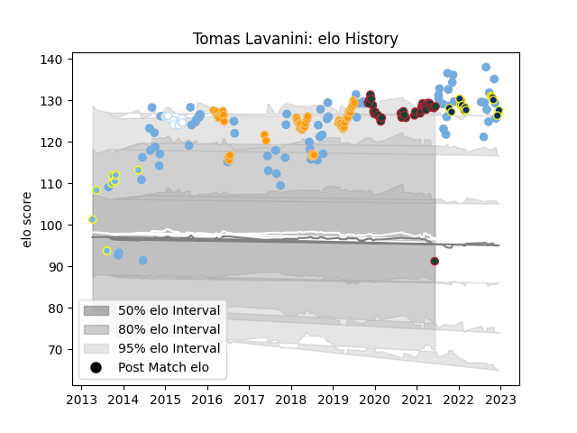

---  
layout: page  
title: Tomas LAVANINI  
date: 2023-01-06 11:51:05.844966  
categories: player  
---
# Tomas LAVANINI

## Positions: L

## Country: Argentina

## Current elo: 112.0

## Current Percentile: 85.0

# Elo History

# Match History

| Team              |   Appearances |   Win Rate |
|:------------------|--------------:|-----------:|
| Argentina         |            75 |   0.273333 |
| Jaguares          |            48 |   0.520833 |
| Leicester Tigers  |            35 |   0.471429 |
| Clermont Auvergne |            17 |   0.323529 |
| Racing 92         |            10 |   0.45     |
| Hindu             |             3 |   1        |

| Opponent                 |   Matches |   Win Rate |
|:-------------------------|----------:|-----------:|
| South Africa             |        17 |  0.176471  |
| New Zealand              |        11 |  0.0909091 |
| Australia                |        11 |  0.272727  |
| Lions                    |         7 |  0.285714  |
| Stormers                 |         6 |  0.5       |
| Ireland                  |         6 |  0.166667  |
| Scotland                 |         6 |  0.166667  |
| Wales                    |         6 |  0.25      |
| England                  |         5 |  0.2       |
| Sharks                   |         5 |  0.6       |
| France                   |         5 |  0.2       |
| Bulls                    |         5 |  0.8       |
| Chiefs                   |         4 |  0.5       |
| Sale Sharks              |         4 |  0         |
| Italy                    |         4 |  1         |
| Brive                    |         4 |  0.25      |
| Brumbies                 |         4 |  0.75      |
| Gloucester Rugby         |         3 |  0.666667  |
| Northampton Saints       |         3 |  0.333333  |
| Worcester Warriors       |         3 |  1         |
| Exeter Chiefs            |         3 |  0         |
| Blues                    |         3 |  0.666667  |
| Bath Rugby               |         3 |  0         |
| Wasps                    |         3 |  1         |
| Bristol Rugby            |         3 |  0.333333  |
| Stade Toulousain         |         3 |  0         |
| Lyon                     |         2 |  1         |
| Queensland Reds          |         2 |  0.5       |
| Perpignan                |         2 |  1         |
| Pau                      |         2 |  0.5       |
| Harlequins               |         2 |  0.25      |
| New South Wales Waratahs |         2 |  1         |
| Highlanders              |         2 |  0         |
| Tonga                    |         2 |  1         |
| Hurricanes               |         2 |  0.5       |
| London Irish             |         2 |  0.5       |
| Crusaders                |         2 |  0         |
| Southern Kings           |         2 |  0.5       |
| Toulon                   |         2 |  0         |
| La Rochelle              |         2 |  0.25      |
| Stade Francais Paris     |         2 |  0         |
| Castres Olympique        |         2 |  0.5       |
| Bordeaux Begles          |         2 |  0.25      |
| Western Force            |         1 |  0         |
| Romania                  |         1 |  1         |
| Atlético del Rosario     |         1 |  1         |
| Racing 92                |         1 |  0         |
| Oyonnax                  |         1 |  0         |
| Montpellier Herault      |         1 |  1         |
| Melbourne Rebels         |         1 |  1         |
| Liceo Naval              |         1 |  1         |
| La Plata                 |         1 |  1         |
| Grenoble                 |         1 |  1         |
| Georgia                  |         1 |  1         |
| Cheetahs                 |         1 |  1         |
| Cardiff Blues            |         1 |  1         |
| Calvisano                |         1 |  1         |
| Benetton Treviso         |         1 |  1         |
| Bayonne                  |         1 |  1         |
| Leicester Tigers         |         1 |  0         |