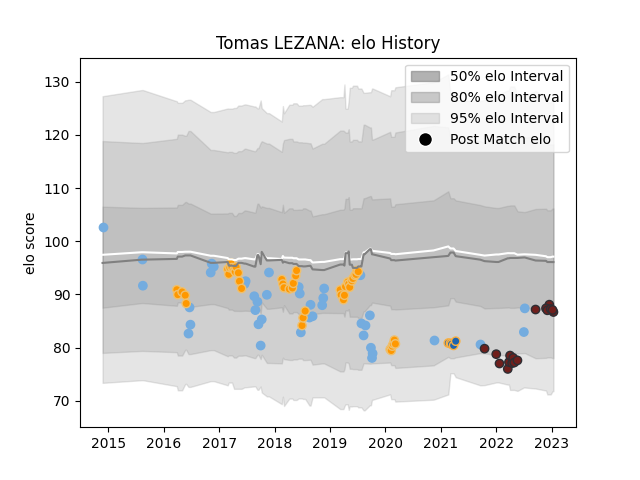

---  
layout: page  
title: Tomas LEZANA  
date: 2023-01-19 11:43:37.306398  
categories: player  
---
# Tomas LEZANA

## Positions: FL, N8

## Country: Argentina

## Current elo: 87.0

## Current Percentile: 26.0

# Elo History

# Match History

| Team          |   Appearances |   Win Rate |
|:--------------|--------------:|-----------:|
| Jaguares      |            47 |   0.489362 |
| Argentina     |            40 |   0.3      |
| Scarlets      |            18 |   0.472222 |
| Western Force |             5 |   0.4      |

| Opponent                 |   Matches |   Win Rate |
|:-------------------------|----------:|-----------:|
| Stormers                 |         9 |   0.222222 |
| South Africa             |         8 |   0.25     |
| Lions                    |         8 |   0.25     |
| Bulls                    |         6 |   0.5      |
| New Zealand              |         6 |   0.166667 |
| Brumbies                 |         5 |   0.4      |
| France                   |         5 |   0.4      |
| Sharks                   |         4 |   0.5      |
| Ospreys                  |         4 |   0.375    |
| England                  |         4 |   0        |
| Wales                    |         3 |   0        |
| Queensland Reds          |         3 |   1        |
| Southern Kings           |         3 |   0.666667 |
| Australia                |         3 |   0        |
| Chiefs                   |         3 |   0.666667 |
| Cheetahs                 |         3 |   1        |
| Georgia                  |         2 |   1        |
| Dragons                  |         2 |   0.5      |
| Ireland                  |         2 |   0        |
| Sunwolves                |         2 |   1        |
| Crusaders                |         2 |   0        |
| Melbourne Rebels         |         2 |   0.5      |
| New South Wales Waratahs |         2 |   1        |
| Cardiff Blues            |         2 |   1        |
| Scotland                 |         2 |   0        |
| Blues                    |         2 |   0.5      |
| Hurricanes               |         2 |   0        |
| United States of America |         1 |   1        |
| Tonga                    |         1 |   1        |
| Western Force            |         1 |   0        |
| Leinster                 |         1 |   0        |
| Portugal                 |         1 |   1        |
| Bayonne                  |         1 |   1        |
| Japan                    |         1 |   1        |
| Italy                    |         1 |   1        |
| Highlanders              |         1 |   0        |
| Bordeaux Begles          |         1 |   0        |
| Zebre                    |         1 |   1        |