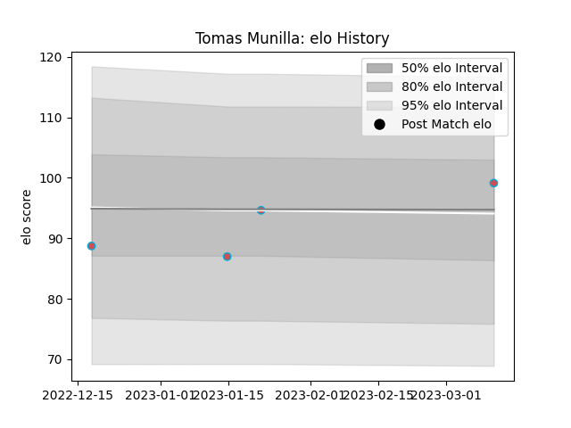

---  
layout: page  
title: Tomas MUNILLA  
date: 2023-01-23 15:35:32.752530  
categories: player  
---
# Tomas MUNILLA

## Positions: SH

## Country: Spain

## Current elo: 112.0

## Current Percentile: 82.0

# Elo History

# Match History

| Team             |   Appearances |   Win Rate |
|:-----------------|--------------:|-----------:|
| Beziers          |            68 |   0.411765 |
| Spain            |            14 |   0.642857 |
| Bourgoin-Jallieu |             8 |   0.625    |

| Opponent                   |   Matches |   Win Rate |
|:---------------------------|----------:|-----------:|
| Mont-de-Marsan             |         6 |   0.333333 |
| Aurillac                   |         5 |   0.6      |
| Colomiers                  |         5 |   0.4      |
| Rouen                      |         5 |   0.6      |
| Oyonnax                    |         5 |   0.2      |
| Nevers                     |         5 |   0.1      |
| Carcassonne                |         5 |   0.4      |
| Montauban                  |         4 |   0.75     |
| Grenoble                   |         4 |   0.25     |
| Vannes                     |         4 |   0.25     |
| Portugal                   |         3 |   0.666667 |
| US Bressane                |         3 |   0        |
| Soyaux-Angouleme           |         3 |   0.333333 |
| Provence Rugby             |         3 |   0.666667 |
| Perpignan                  |         2 |   0        |
| Russia                     |         2 |   1        |
| Roval Drome XV             |         2 |   1        |
| Biarritz Olympique         |         2 |   0        |
| Romania                    |         2 |   0.5      |
| Narbonne                   |         2 |   0.5      |
| Bayonne                    |         2 |   0.5      |
| Georgia                    |         2 |   0        |
| Brazil                     |         1 |   1        |
| Nice                       |         1 |   1        |
| Blagnac                    |         1 |   0        |
| Cognac Saint Jean d'Angély |         1 |   1        |
| Netherlands                |         1 |   1        |
| Rennes                     |         1 |   1        |
| Brive                      |         1 |   1        |
| Canada                     |         1 |   1        |
| Massy                      |         1 |   1        |
| Carqueiranne-Hyères        |         1 |   1        |
| Samoa                      |         1 |   0        |
| Chambery                   |         1 |   1        |
| Valence Romans Drome Rugby |         1 |   0.5      |
| Chile                      |         1 |   1        |