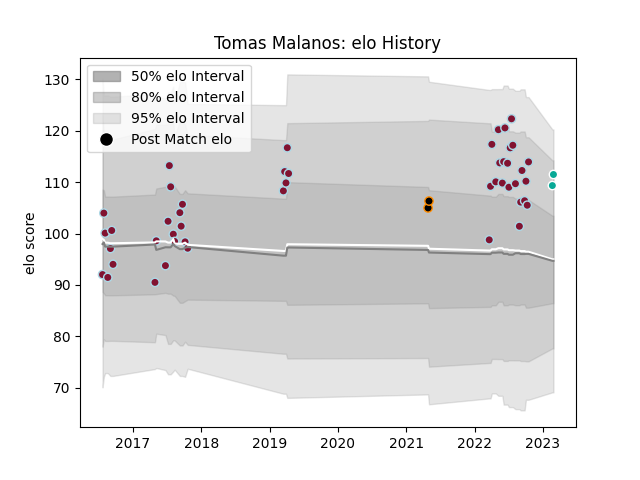

---  
layout: page  
title: Tomas Malanos  
date: 2023-03-02 11:21:34.103927  
categories: player  
---
# Tomas Malanos

## Positions: C, FB

## Current elo: 111.0

## Current Percentile: 84.0

# Elo History

# Match History

| Team                 |   Appearances |   Win Rate |
|:---------------------|--------------:|-----------:|
| Atlético del Rosario |            47 |    0.37234 |
| Dallas Jackals       |             2 |    0       |
| Jaguares XV          |             2 |    1       |

| Opponent            |   Matches |   Win Rate |
|:--------------------|----------:|-----------:|
| Alumni              |         5 |   0.4      |
| Pucara              |         5 |   0.3      |
| CUBA                |         5 |   0        |
| San Luis            |         5 |   0.6      |
| SIC                 |         5 |   0.3      |
| CASI                |         4 |   0.625    |
| Newman              |         4 |   0.5      |
| Hindu               |         3 |   0        |
| Belgrano            |         3 |   0        |
| Regatas Bella Vista |         3 |   0.333333 |
| Buenos Aires        |         2 |   0.5      |
| Los Tilos           |         2 |   1        |
| Mariano Moreno      |         1 |   1        |
| Penarol Rugby       |         1 |   1        |
| Olimpia Lions       |         1 |   1        |
| Houston SaberCats   |         1 |   0        |
| Utah Warriors       |         1 |   0        |