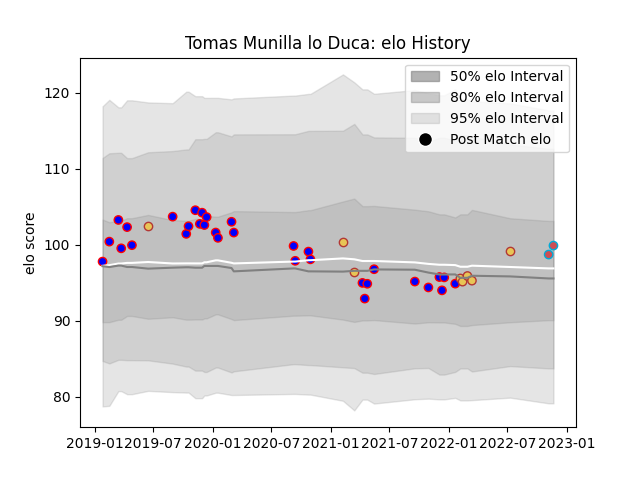

---  
layout: page  
title: Tomas Munilla lo Duca  
date: 2022-12-18 16:34:31.015666  
categories: player  
---
# Tomas Munilla lo Duca

## Positions: SH

## Country: Spain

## Current elo: 100.0

## Current Percentile: 65.0

# Elo History

# Match History

| Team             |   Appearances |   Win Rate |
|:-----------------|--------------:|-----------:|
| Beziers          |            32 |      0.375 |
| Spain            |             8 |      0.875 |
| Bourgoin-Jallieu |             5 |      0.6   |

| Opponent                   |   Matches |   Win Rate |
|:---------------------------|----------:|-----------:|
| Nevers                     |         4 |   0.125    |
| Mont-de-Marsan             |         3 |   0.333333 |
| Carcassonne                |         3 |   0.333333 |
| Oyonnax                    |         3 |   0        |
| Montauban                  |         2 |   0.5      |
| Roval Drome XV             |         2 |   1        |
| Rouen                      |         2 |   1        |
| Portugal                   |         2 |   1        |
| Biarritz Olympique         |         2 |   0        |
| Vannes                     |         2 |   0.5      |
| Colomiers                  |         2 |   0.5      |
| Georgia                    |         1 |   0        |
| Rennes                     |         1 |   1        |
| Valence Romans Drome Rugby |         1 |   0.5      |
| US Bressane                |         1 |   0        |
| Soyaux-Angouleme           |         1 |   0        |
| Russia                     |         1 |   1        |
| Blagnac                    |         1 |   0        |
| Brive                      |         1 |   1        |
| Romania                    |         1 |   1        |
| Canada                     |         1 |   1        |
| Grenoble                   |         1 |   0        |
| Perpignan                  |         1 |   0        |
| Chambery                   |         1 |   1        |
| Chile                      |         1 |   1        |
| Netherlands                |         1 |   1        |
| Cognac Saint Jean d'Angély |         1 |   1        |
| Massy                      |         1 |   1        |
| Aurillac                   |         1 |   0        |