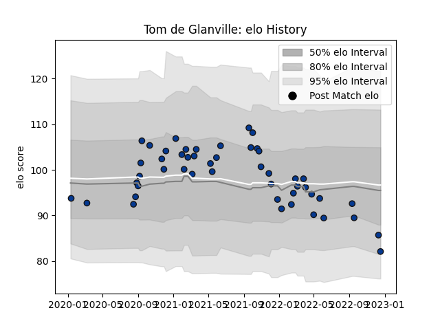

---  
layout: page  
title: Tom de Glanville  
date: 2022-12-18 16:32:52.122480  
categories: player  
---
# Tom de Glanville

## Positions: FB

## Current elo: 82.0

## Current Percentile: 17.0

# Elo History

# Match History

| Team       |   Appearances |   Win Rate |
|:-----------|--------------:|-----------:|
| Bath Rugby |            49 |   0.336735 |

| Opponent           |   Matches |   Win Rate |
|:-------------------|----------:|-----------:|
| Exeter Chiefs      |         6 |   0        |
| Sale Sharks        |         6 |   0.416667 |
| Bristol Rugby      |         5 |   0.2      |
| Harlequins         |         5 |   0.2      |
| Worcester Warriors |         5 |   0.8      |
| Newcastle Falcons  |         4 |   0.5      |
| Northampton Saints |         4 |   0.5      |
| Wasps              |         4 |   0        |
| Gloucester Rugby   |         3 |   0.333333 |
| Leicester Tigers   |         2 |   0.5      |
| London Irish       |         2 |   1        |
| Glasgow Warriors   |         1 |   0        |
| Saracens           |         1 |   0        |
| Toulon             |         1 |   0        |