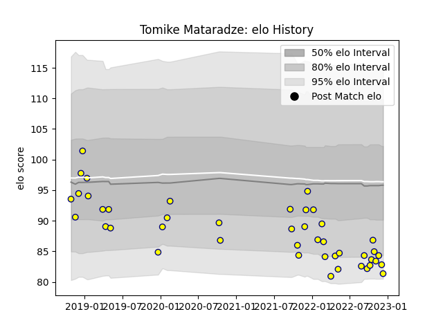

---  
layout: page  
title: Tomike Mataradze  
date: 2023-03-09 10:12:22.970264  
categories: player  
---
# Tomike Mataradze

## Positions: P

## Current elo: 103.0

## Current Percentile: 67.0

# Elo History

# Match History

| Team   |   Appearances |   Win Rate |
|:-------|--------------:|-----------:|
| Nevers |             8 |      0.625 |

| Opponent         |   Matches |   Win Rate |
|:-----------------|----------:|-----------:|
| Carcassonne      |         2 |        0.5 |
| Aurillac         |         1 |        1   |
| Mont-de-Marsan   |         1 |        1   |
| Oyonnax          |         1 |        0   |
| Provence Rugby   |         1 |        0   |
| Soyaux-Angouleme |         1 |        1   |
| Vannes           |         1 |        1   |