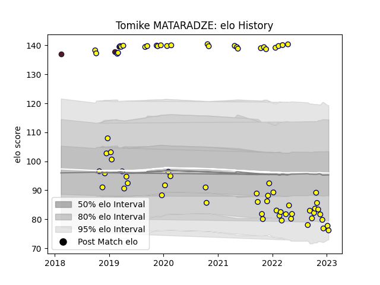

---  
layout: page  
title: Tomike MATARADZE  
date: 2023-02-02 18:44:11.401084  
categories: player  
---
# Tomike MATARADZE

## Positions: P

## Country: Georgia

## Current elo: 79.0

## Current Percentile: 7.0

# Elo History

# Match History

| Team    |   Appearances |   Win Rate |
|:--------|--------------:|-----------:|
| Nevers  |            73 |   0.513699 |
| Georgia |             3 |   1        |

| Opponent                   |   Matches |   Win Rate |
|:---------------------------|----------:|-----------:|
| Beziers                    |         7 |   0.642857 |
| Oyonnax                    |         6 |   0.166667 |
| Aurillac                   |         6 |   0.5      |
| Montauban                  |         5 |   0.4      |
| Colomiers                  |         5 |   0.4      |
| Provence Rugby             |         5 |   0.8      |
| Vannes                     |         5 |   0.4      |
| Bayonne                    |         4 |   0.375    |
| Grenoble                   |         4 |   0.375    |
| Mont-de-Marsan             |         4 |   0.5      |
| Rouen                      |         4 |   1        |
| Carcassonne                |         3 |   0.666667 |
| US Bressane                |         3 |   0.666667 |
| Soyaux-Angouleme           |         2 |   0.5      |
| Perpignan                  |         2 |   0        |
| Narbonne                   |         2 |   1        |
| Agen                       |         2 |   0.5      |
| Germany                    |         1 |   1        |
| Belgium                    |         1 |   1        |
| Romania                    |         1 |   1        |
| Roval Drome XV             |         1 |   1        |
| Brive                      |         1 |   0        |
| Massy                      |         1 |   1        |
| Valence Romans Drome Rugby |         1 |   0        |