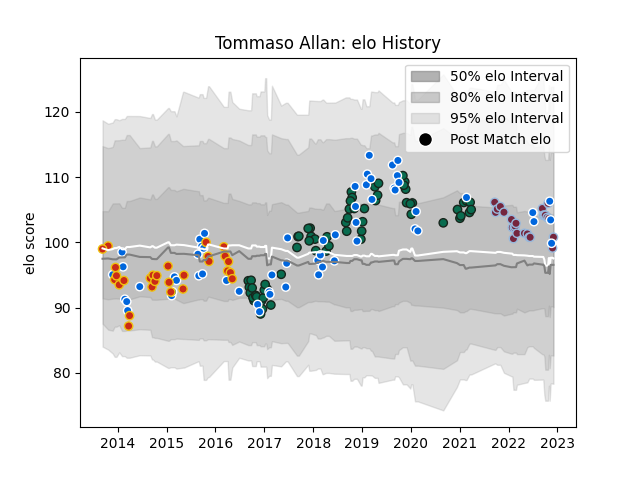

---  
layout: page  
title: Tommaso Allan  
date: 2022-12-09 13:17:36.850899  
categories: player  
---
# Tommaso Allan

## Positions: FH

## Country: Italy

## Current elo: 101.0

## Current Percentile: 61.0

# Elo History

# Match History

| Team             |   Appearances |   Win Rate |
|:-----------------|--------------:|-----------:|
| Benetton Treviso |            64 |   0.335938 |
| Italy            |            59 |   0.220339 |
| Perpignan        |            28 |   0.428571 |
| Harlequins       |            25 |   0.56     |

| Opponent             |   Matches |   Win Rate |
|:---------------------|----------:|-----------:|
| Zebre                |        10 |   0.7      |
| Scotland             |         8 |   0.125    |
| Wales                |         7 |   0        |
| Munster              |         7 |   0        |
| France               |         7 |   0        |
| England              |         7 |   0        |
| Scarlets             |         6 |   0        |
| Ireland              |         6 |   0        |
| Edinburgh            |         6 |   0.5      |
| Cardiff Blues        |         5 |   0.2      |
| Glasgow Warriors     |         5 |   0.2      |
| Leinster             |         5 |   0.3      |
| Saracens             |         4 |   0        |
| Dragons              |         4 |   0.75     |
| Ulster               |         4 |   0        |
| Northampton Saints   |         4 |   0.25     |
| Georgia              |         3 |   0.666667 |
| Mont-de-Marsan       |         3 |   0.333333 |
| Bayonne              |         3 |   1        |
| Canada               |         3 |   1        |
| Gloucester Rugby     |         3 |   0.666667 |
| Bath Rugby           |         3 |   0.333333 |
| Agen                 |         3 |   0.666667 |
| Australia            |         3 |   0.333333 |
| Newcastle Falcons    |         3 |   1        |
| New Zealand          |         2 |   0        |
| London Irish         |         2 |   0.5      |
| South Africa         |         2 |   0        |
| Romania              |         2 |   1        |
| Montauban            |         2 |   0        |
| Sale Sharks          |         2 |   0.5      |
| Samoa                |         2 |   0.5      |
| Albi                 |         2 |   0.5      |
| Beziers              |         2 |   1        |
| Castres Olympique    |         2 |   0.5      |
| Worcester Warriors   |         2 |   1        |
| Exeter Chiefs        |         2 |   0        |
| Biarritz Olympique   |         2 |   1        |
| Grenoble             |         2 |   1        |
| Japan                |         2 |   0.5      |
| La Rochelle          |         2 |   0        |
| Southern Kings       |         1 |   1        |
| Tarbes               |         1 |   0        |
| Toulon               |         1 |   0        |
| Argentina            |         1 |   0        |
| Aurillac             |         1 |   0        |
| Wasps                |         1 |   1        |
| Stade Francais Paris |         1 |   1        |
| Tonga                |         1 |   0        |
| Carcassonne          |         1 |   1        |
| Russia               |         1 |   1        |
| Racing 92            |         1 |   0        |
| Ospreys              |         1 |   0        |
| Namibia              |         1 |   1        |
| Massy                |         1 |   1        |
| Lyon                 |         1 |   0        |
| Leicester Tigers     |         1 |   0        |
| Fiji                 |         1 |   0        |
| Bordeaux Begles      |         1 |   0        |
| Bristol Rugby        |         1 |   1        |
| Connacht             |         1 |   0        |
| Colomiers            |         1 |   0        |
| Montpellier Herault  |         1 |   0        |