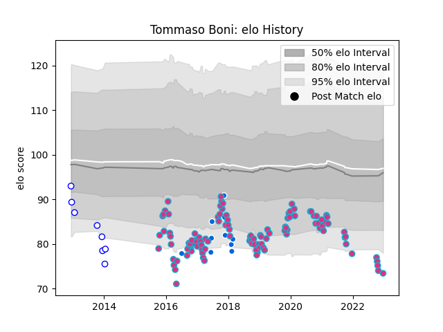

---  
layout: page  
title: Tommaso Boni  
date: 2022-12-28 12:57:18.288954  
categories: player  
---
# Tommaso Boni

## Positions: C

## Country: Italy

## Current elo: 73.0

## Current Percentile: 2.0

# Elo History

# Match History

| Team     |   Appearances |   Win Rate |
|:---------|--------------:|-----------:|
| Zebre    |           111 |   0.198198 |
| Italy    |            11 |   0.181818 |
| Mogliano |             8 |   0        |

| Opponent             |   Matches |   Win Rate |
|:---------------------|----------:|-----------:|
| Benetton Treviso     |        14 |   0.214286 |
| Dragons              |        11 |   0.363636 |
| Connacht             |         9 |   0.222222 |
| Ospreys              |         8 |   0.125    |
| Glasgow Warriors     |         8 |   0        |
| Ulster               |         7 |   0.142857 |
| Munster              |         7 |   0        |
| Edinburgh            |         7 |   0.285714 |
| Leinster             |         6 |   0        |
| Scarlets             |         6 |   0        |
| Bristol Rugby        |         4 |   0.375    |
| Cardiff Blues        |         4 |   0.25     |
| La Rochelle          |         3 |   0.333333 |
| Cheetahs             |         3 |   0        |
| Pau                  |         2 |   0        |
| RC Enisei            |         2 |   1        |
| Wasps                |         2 |   0        |
| Agen                 |         2 |   0.5      |
| Gloucester Rugby     |         2 |   0        |
| Bayonne              |         2 |   0.25     |
| Fiji                 |         2 |   0.5      |
| Bath Rugby           |         2 |   0        |
| Scotland             |         1 |   0        |
| Australia            |         1 |   0        |
| Stormers             |         1 |   0        |
| Stade Toulousain     |         1 |   0        |
| Stade Francais Paris |         1 |   0        |
| Southern Kings       |         1 |   1        |
| South Africa         |         1 |   0        |
| Argentina            |         1 |   0        |
| Ireland              |         1 |   0        |
| Bordeaux Begles      |         1 |   0        |
| Brive                |         1 |   0        |
| Canada               |         1 |   1        |
| New Zealand          |         1 |   0        |
| England              |         1 |   0        |
| Lions                |         1 |   0        |
| France               |         1 |   0        |
| Worcester Warriors   |         1 |   1        |