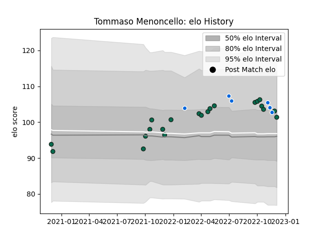

---  
layout: page  
title: Tommaso Menoncello  
date: 2022-12-14 11:34:34.674135  
categories: player  
---
# Tommaso Menoncello

## Positions: C, W

## Country: Italy

## Current elo: 101.0

## Current Percentile: 68.0

# Elo History

# Match History

| Team             |   Appearances |   Win Rate |
|:-----------------|--------------:|-----------:|
| Benetton Treviso |            22 |   0.363636 |
| Italy            |             6 |   0.5      |

| Opponent             |   Matches |   Win Rate |
|:---------------------|----------:|-----------:|
| Edinburgh            |         4 |        0.5 |
| Connacht             |         3 |        0   |
| Zebre                |         2 |        1   |
| Dragons              |         2 |        0.5 |
| Scarlets             |         2 |        0.5 |
| Bulls                |         2 |        0   |
| Romania              |         1 |        1   |
| Stormers             |         1 |        1   |
| Stade Francais Paris |         1 |        0   |
| South Africa         |         1 |        0   |
| Samoa                |         1 |        1   |
| Australia            |         1 |        1   |
| Ospreys              |         1 |        0   |
| Munster              |         1 |        0   |
| Leinster             |         1 |        0   |
| Glasgow Warriors     |         1 |        1   |
| Georgia              |         1 |        0   |
| France               |         1 |        0   |
| Lions                |         1 |        0   |