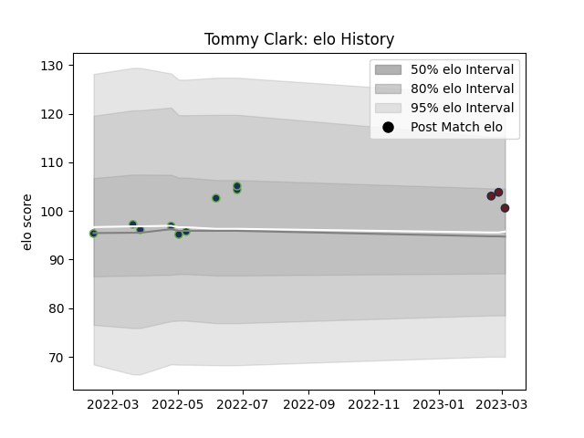

---  
layout: page  
title: Tommy Clark  
date: 2023-03-04 11:40:51.888723  
categories: player  
---
# Tommy Clark

## Positions: FL

## Current elo: 101.0

## Current Percentile: 71.0

# Elo History

# Match History

| Team              |   Appearances |   Win Rate |
|:------------------|--------------:|-----------:|
| Seattle Seawolves |             9 |   0.555556 |
| American Raptors  |             3 |   0        |

| Opponent         |   Matches |   Win Rate |
|:-----------------|----------:|-----------:|
| Dallas Jackals   |         2 |        1   |
| L. A. Giltinis   |         2 |        0.5 |
| Utah Warriors    |         2 |        1   |
| Austin Gilgronis |         1 |        0   |
| Pampas XV        |         1 |        0   |
| Penarol Rugby    |         1 |        0   |
| R.U. New York    |         1 |        0   |
| Rugby New York   |         1 |        0   |
| Selknam          |         1 |        0   |