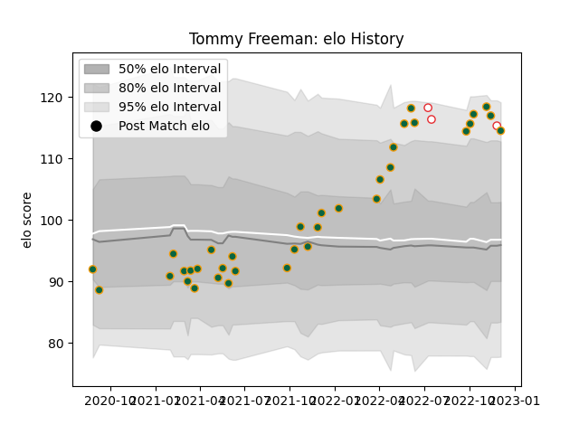

---  
layout: page  
title: Tommy Freeman  
date: 2022-11-22 11:36:59.469767  
categories: player  
---
# Tommy Freeman

## Positions: W, FB

## Country: England

## Current elo: 114.0

## Current Percentile: 92.0

# Elo History

# Match History

| Team               |   Appearances |   Win Rate |
|:-------------------|--------------:|-----------:|
| Northampton Saints |            34 |   0.529412 |
| England            |             2 |   1        |

| Opponent           |   Matches |   Win Rate |
|:-------------------|----------:|-----------:|
| Bath Rugby         |         5 |   0.4      |
| Bristol Rugby      |         4 |   0.5      |
| Wasps              |         4 |   0.75     |
| Exeter Chiefs      |         3 |   0.666667 |
| Harlequins         |         3 |   0.333333 |
| Leicester Tigers   |         3 |   0.333333 |
| Newcastle Falcons  |         3 |   0.666667 |
| Australia          |         2 |   1        |
| Gloucester Rugby   |         2 |   0.5      |
| Sale Sharks        |         2 |   0.5      |
| Saracens           |         2 |   0        |
| Worcester Warriors |         2 |   1        |
| London Irish       |         1 |   1        |