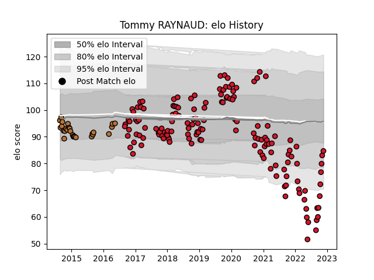

---  
layout: page  
title: Tommy RAYNAUD  
date: 2023-01-27 11:07:46.950819  
categories: player  
---
# Tommy RAYNAUD

## Positions: P

## Current elo: 71.0

## Current Percentile: 11.0

# Elo History

# Match History

| Team     |   Appearances |   Win Rate |
|:---------|--------------:|-----------:|
| Oyonnax  |           150 |   0.593333 |
| Narbonne |            27 |   0.37037  |

| Opponent                   |   Matches |   Win Rate |
|:---------------------------|----------:|-----------:|
| Beziers                    |        13 |   0.692308 |
| Colomiers                  |        13 |   0.423077 |
| Mont-de-Marsan             |        11 |   0.318182 |
| Carcassonne                |        10 |   0.7      |
| Aurillac                   |        10 |   0.5      |
| Montauban                  |        10 |   0.75     |
| Provence Rugby             |         8 |   0.8125   |
| Vannes                     |         8 |   0.625    |
| Biarritz Olympique         |         8 |   0.25     |
| Nevers                     |         7 |   0.714286 |
| Grenoble                   |         6 |   0.5      |
| Soyaux-Angouleme           |         6 |   1        |
| Agen                       |         6 |   0.666667 |
| Perpignan                  |         4 |   0.25     |
| Bourgoin-Jallieu           |         4 |   0.5      |
| Rouen                      |         4 |   0.75     |
| Bayonne                    |         4 |   0.5      |
| Pau                        |         4 |   0        |
| Brive                      |         4 |   0.25     |
| Massy                      |         4 |   0.75     |
| Albi                       |         3 |   1        |
| US Bressane                |         3 |   0.666667 |
| Narbonne                   |         3 |   0.666667 |
| Lyon                       |         3 |   0.666667 |
| Castres Olympique          |         2 |   0        |
| Toulon                     |         2 |   0.5      |
| Stade Toulousain           |         2 |   0.25     |
| Stade Francais Paris       |         2 |   0.5      |
| Bordeaux Begles            |         2 |   0.5      |
| La Rochelle                |         2 |   0.25     |
| Dax                        |         2 |   0.5      |
| Roval Drome XV             |         1 |   1        |
| Clermont Auvergne          |         1 |   1        |
| Racing 92                  |         1 |   0        |
| Tarbes                     |         1 |   1        |
| Montpellier Herault        |         1 |   0        |
| Valence Romans Drome Rugby |         1 |   1        |
| Connacht                   |         1 |   0        |