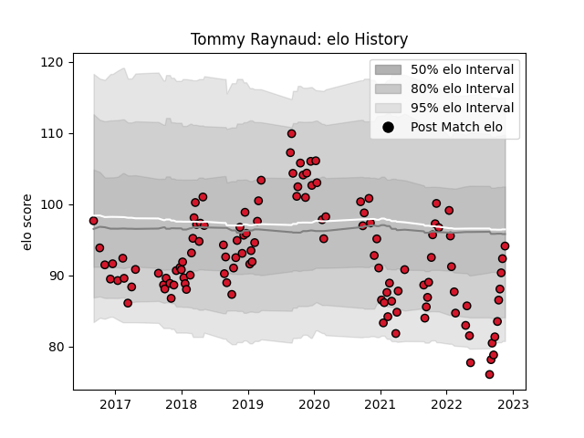

---  
layout: page  
title: Tommy Raynaud  
date: 2022-12-14 11:12:13.974729  
categories: player  
---
# Tommy Raynaud

## Positions: P

## Current elo: 90.0

## Current Percentile: 30.0

# Elo History

# Match History

| Team    |   Appearances |   Win Rate |
|:--------|--------------:|-----------:|
| Oyonnax |           122 |   0.577869 |

| Opponent                   |   Matches |   Win Rate |
|:---------------------------|----------:|-----------:|
| Beziers                    |        10 |   0.7      |
| Carcassonne                |         8 |   0.875    |
| Vannes                     |         7 |   0.571429 |
| Colomiers                  |         7 |   0.428571 |
| Provence Rugby             |         7 |   0.785714 |
| Montauban                  |         7 |   0.785714 |
| Nevers                     |         6 |   0.666667 |
| Grenoble                   |         6 |   0.5      |
| Aurillac                   |         5 |   0.4      |
| Mont-de-Marsan             |         5 |   0.5      |
| Brive                      |         4 |   0.25     |
| Soyaux-Angouleme           |         4 |   1        |
| Biarritz Olympique         |         4 |   0.25     |
| Agen                       |         3 |   0.666667 |
| Rouen                      |         3 |   0.666667 |
| Bayonne                    |         3 |   0.666667 |
| Perpignan                  |         3 |   0.333333 |
| Narbonne                   |         3 |   0.666667 |
| Castres Olympique          |         2 |   0        |
| US Bressane                |         2 |   0.5      |
| Toulon                     |         2 |   0.5      |
| Stade Toulousain           |         2 |   0.25     |
| Stade Francais Paris       |         2 |   0.5      |
| Pau                        |         2 |   0        |
| Bordeaux Begles            |         2 |   0.5      |
| Lyon                       |         2 |   0.5      |
| La Rochelle                |         2 |   0.25     |
| Montpellier Herault        |         1 |   0        |
| Racing 92                  |         1 |   0        |
| Bourgoin-Jallieu           |         1 |   1        |
| Roval Drome XV             |         1 |   1        |
| Massy                      |         1 |   1        |
| Dax                        |         1 |   1        |
| Connacht                   |         1 |   0        |
| Valence Romans Drome Rugby |         1 |   1        |
| Clermont Auvergne          |         1 |   1        |