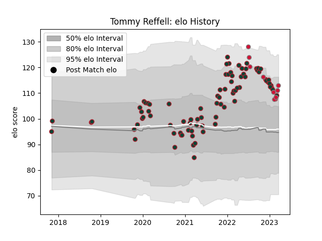

---  
layout: page  
title: Tommy Reffell  
date: 2023-03-17 17:09:17.930366  
categories: player  
---
# Tommy Reffell

## Positions: FL

## Country: Wales

## Current elo: 111.0

## Current Percentile: 82.0

# Elo History

# Match History

| Team             |   Appearances |   Win Rate |
|:-----------------|--------------:|-----------:|
| Leicester Tigers |            85 |   0.635294 |
| Wales            |             8 |   0.25     |

| Opponent            |   Matches |   Win Rate |
|:--------------------|----------:|-----------:|
| Exeter Chiefs       |         7 |   0.285714 |
| Saracens            |         7 |   0.428571 |
| Bath Rugby          |         6 |   0.5      |
| Newcastle Falcons   |         6 |   0.833333 |
| Harlequins          |         6 |   0.583333 |
| Gloucester Rugby    |         6 |   1        |
| London Irish        |         6 |   0.833333 |
| Bristol Rugby       |         6 |   0.583333 |
| Northampton Saints  |         5 |   0.8      |
| Sale Sharks         |         5 |   0.2      |
| Wasps               |         4 |   0.75     |
| Worcester Warriors  |         4 |   0.75     |
| Clermont Auvergne   |         4 |   1        |
| South Africa        |         3 |   0.333333 |
| Connacht            |         2 |   1        |
| Cardiff Blues       |         1 |   1        |
| Ulster              |         1 |   0        |
| Toulon              |         1 |   0        |
| Scotland            |         1 |   0        |
| Scarlets            |         1 |   1        |
| Bordeaux Begles     |         1 |   1        |
| Ireland             |         1 |   0        |
| Italy               |         1 |   1        |
| Ospreys             |         1 |   0        |
| England             |         1 |   0        |
| Calvisano           |         1 |   1        |
| New Zealand         |         1 |   0        |
| Montpellier Herault |         1 |   0        |
| Bayonne             |         1 |   1        |
| Leinster            |         1 |   0        |
| Pau                 |         1 |   1        |