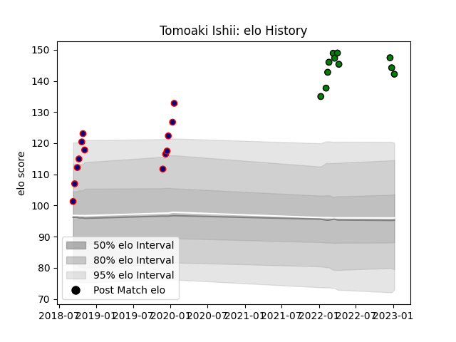

---  
layout: page  
title: Tomoaki Ishii  
date: 2023-03-21 18:10:57.541126  
categories: player  
---
# Tomoaki Ishii

Last updated: 2023-03-21
## Positions: P

## Current elo: 135.0

## Current Percentile: 98.0

# Elo History

# Match History

| Team                     |   Appearances |   Win Rate |
|:-------------------------|--------------:|-----------:|
| Mitsubishi Dynaboars     |            20 |   0.625    |
| Hanazono Kintetsu Liners |            15 |   0.933333 |

| Opponent                          |   Matches |   Win Rate |
|:----------------------------------|----------:|-----------:|
| Kamaishi Seawaves                 |         3 |        1   |
| Mie Honda Heat                    |         2 |        0.5 |
| Saitama Wild Knights              |         2 |        0   |
| Urayasu D-Rocks                   |         2 |        1   |
| Hanazono Kintetsu Liners          |         2 |        1   |
| Hino Red Dolphins                 |         2 |        1   |
| Toyota Industries Shuttles Aichi  |         2 |        0.5 |
| Kurita Water Gush                 |         2 |        1   |
| Kyuden Voltex                     |         2 |        1   |
| Mazda Blue Zoomers                |         2 |        1   |
| Toyota Verblitz                   |         1 |        1   |
| Toshiba Brave Lupus Tokyo         |         1 |        1   |
| Skyactivs Hiroshima               |         1 |        1   |
| Shizuoka Blue Revs                |         1 |        0.5 |
| Shimizu Blue Sharks               |         1 |        1   |
| Black Rams Tokyo                  |         1 |        1   |
| NTT Docomo Red Hurricanes Osaka   |         1 |        1   |
| Mitsubishi Dynaboars              |         1 |        1   |
| Chugoku Red Regulions             |         1 |        1   |
| Kubota Spears Funabashi Tokyo-Bay |         1 |        0   |
| Kobelco Kobe Steelers             |         1 |        0   |
| Green Rockets Tokatsu             |         1 |        0   |
| Coca-Cola Red Sparks              |         1 |        1   |
| Yokohama Canon Eagles             |         1 |        0   |