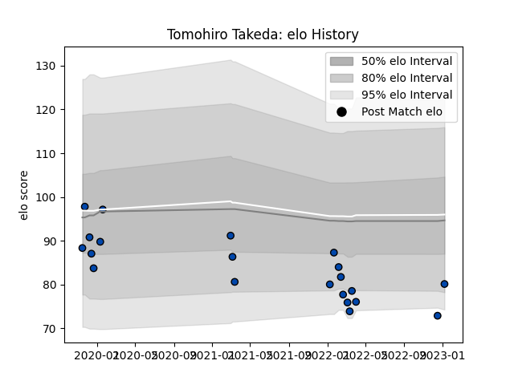

---  
layout: page  
title: Tomohiro Takeda  
date: 2023-03-21 18:06:59.246016  
categories: player  
---
# Tomohiro Takeda

Last updated: 2023-03-21
## Positions: H, FL

## Current elo: 74.0

## Current Percentile: 8.0

# Elo History

# Match History

| Team                |   Appearances |   Win Rate |
|:--------------------|--------------:|-----------:|
| Skyactivs Hiroshima |            20 |   0.2      |
| Mazda Blue Zoomers  |             7 |   0.285714 |

| Opponent                         |   Matches |   Win Rate |
|:---------------------------------|----------:|-----------:|
| Kyuden Voltex                    |         5 |   0.2      |
| Kamaishi Seawaves                |         4 |   0.25     |
| Hanazono Kintetsu Liners         |         3 |   0        |
| Kurita Water Gush                |         3 |   0.333333 |
| Chugoku Red Regulions            |         2 |   1        |
| Mie Honda Heat                   |         2 |   0        |
| Mitsubishi Dynaboars             |         2 |   0        |
| Toyota Industries Shuttles Aichi |         2 |   0        |
| Coca-Cola Red Sparks             |         1 |   0        |
| Hino Red Dolphins                |         1 |   0        |
| NTT Docomo Red Hurricanes Osaka  |         1 |   0        |
| Shimizu Blue Sharks              |         1 |   1        |