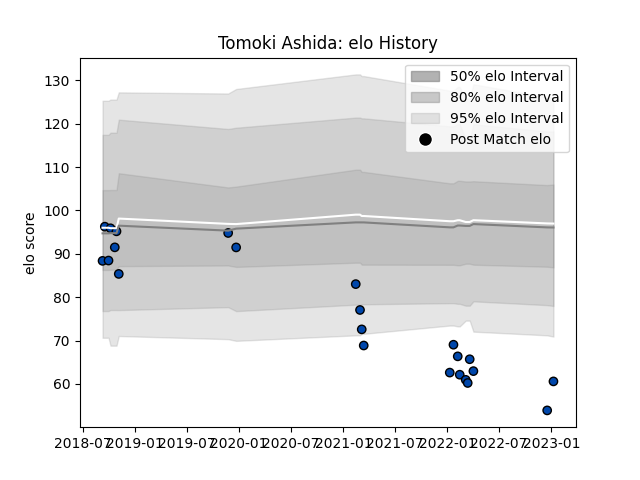

---  
layout: page  
title: Tomoki Ashida  
date: 2023-03-21 18:44:06.814173  
categories: player  
---
# Tomoki Ashida

Last updated: 2023-03-21
## Positions: FL

## Current elo: 63.0

## Current Percentile: 3.0

# Elo History

# Match History

| Team                |   Appearances |   Win Rate |
|:--------------------|--------------:|-----------:|
| Skyactivs Hiroshima |            18 |   0.166667 |
| Mazda Blue Zoomers  |             9 |   0.333333 |

| Opponent                         |   Matches |   Win Rate |
|:---------------------------------|----------:|-----------:|
| Kamaishi Seawaves                |         5 |   0.4      |
| NTT Docomo Red Hurricanes Osaka  |         4 |   0        |
| Chugoku Red Regulions            |         3 |   0.666667 |
| Hanazono Kintetsu Liners         |         3 |   0        |
| Mitsubishi Dynaboars             |         3 |   0        |
| Kurita Water Gush                |         2 |   0        |
| Kyuden Voltex                    |         2 |   0.5      |
| Coca-Cola Red Sparks             |         1 |   0        |
| Hino Red Dolphins                |         1 |   0        |
| Mie Honda Heat                   |         1 |   0        |
| Shimizu Blue Sharks              |         1 |   1        |
| Toyota Industries Shuttles Aichi |         1 |   0        |