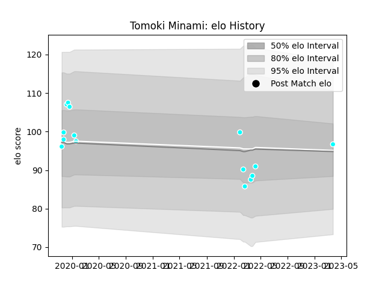

---  
layout: page  
title: Tomoki Minami  
date: 2023-03-27 11:35:02.165518  
categories: player  
---
# Tomoki Minami

Last updated: 2023-03-27
## Positions: P

## Current elo: 97.0

## Current Percentile: 32.0

# Elo History

# Match History

| Team                             |   Appearances |   Win Rate |
|:---------------------------------|--------------:|-----------:|
| Toyota Industries Shuttles Aichi |            15 |        0.8 |

| Opponent                 |   Matches |   Win Rate |
|:-------------------------|----------:|-----------:|
| Shimizu Blue Sharks      |         4 |          1 |
| Kyuden Voltex            |         3 |          1 |
| Hanazono Kintetsu Liners |         2 |          0 |
| Kurita Water Gush        |         2 |          1 |
| Chugoku Red Regulions    |         1 |          1 |
| Coca-Cola Red Sparks     |         1 |          0 |
| Kamaishi Seawaves        |         1 |          1 |
| Mazda Blue Zoomers       |         1 |          1 |