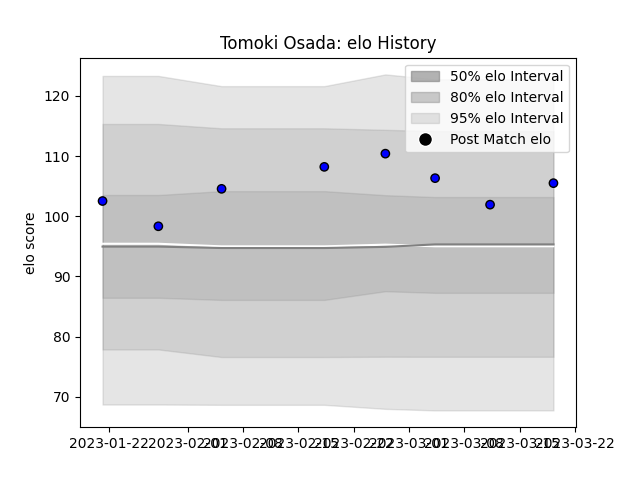

---  
layout: page  
title: Tomoki Osada  
date: 2023-03-17 17:08:42.695353  
categories: player  
---
# Tomoki Osada

## Positions: C, W

## Current elo: 105.0

## Current Percentile: 87.0

# Elo History

# Match History

| Team                 |   Appearances |   Win Rate |
|:---------------------|--------------:|-----------:|
| Saitama Wild Knights |             7 |          1 |

| Opponent                          |   Matches |   Win Rate |
|:----------------------------------|----------:|-----------:|
| Black Rams Tokyo                  |         1 |          1 |
| Green Rockets Tokatsu             |         1 |          1 |
| Hanazono Kintetsu Liners          |         1 |          1 |
| Kobelco Kobe Steelers             |         1 |          1 |
| Kubota Spears Funabashi Tokyo-Bay |         1 |          1 |
| Tokyo Sungoliath                  |         1 |          1 |
| Yokohama Canon Eagles             |         1 |          1 |