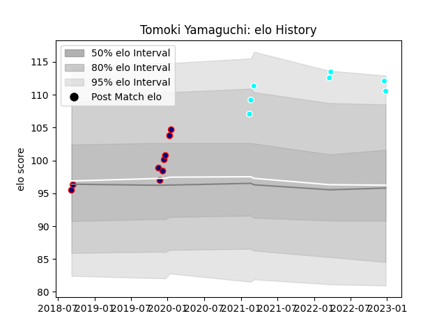

---  
layout: page  
title: Tomoki Yamaguchi  
date: 2023-03-21 18:05:10.973715  
categories: player  
---
# Tomoki Yamaguchi

Last updated: 2023-03-21
## Positions: P

## Current elo: 118.0

## Current Percentile: 95.0

# Elo History

# Match History

| Team                             |   Appearances |   Win Rate |
|:---------------------------------|--------------:|-----------:|
| Toyota Industries Shuttles Aichi |            13 |   0.692308 |
| Hanazono Kintetsu Liners         |            10 |   1        |

| Opponent                         |   Matches |   Win Rate |
|:---------------------------------|----------:|-----------:|
| Kyuden Voltex                    |         4 |          1 |
| Coca-Cola Red Sparks             |         3 |          1 |
| Kamaishi Seawaves                |         2 |          1 |
| Kurita Water Gush                |         2 |          1 |
| Mazda Blue Zoomers               |         2 |          1 |
| Shimizu Blue Sharks              |         2 |          1 |
| Urayasu D-Rocks                  |         2 |          0 |
| Chugoku Red Regulions            |         1 |          1 |
| Green Rockets Tokatsu            |         1 |          0 |
| Hanazono Kintetsu Liners         |         1 |          1 |
| Hino Red Dolphins                |         1 |          1 |
| Mie Honda Heat                   |         1 |          0 |
| Toyota Industries Shuttles Aichi |         1 |          1 |