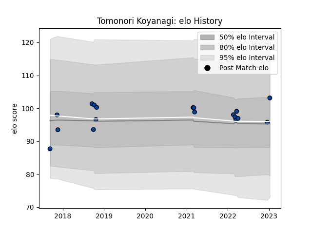

---  
layout: page  
title: Tomonori Koyanagi  
date: 2023-03-21 18:40:12.238445  
categories: player  
---
# Tomonori Koyanagi

Last updated: 2023-03-21
## Positions: P

## Current elo: 89.0

## Current Percentile: 42.0

# Elo History

# Match History

| Team                |   Appearances |   Win Rate |
|:--------------------|--------------:|-----------:|
| Skyactivs Hiroshima |            17 |   0.235294 |
| Mazda Blue Zoomers  |             8 |   0.4375   |

| Opponent                         |   Matches |   Win Rate |
|:---------------------------------|----------:|-----------:|
| Kyuden Voltex                    |         5 |   0.2      |
| NTT Docomo Red Hurricanes Osaka  |         4 |   0        |
| Chugoku Red Regulions            |         3 |   1        |
| Kamaishi Seawaves                |         3 |   0.833333 |
| Kurita Water Gush                |         3 |   0.333333 |
| Mie Honda Heat                   |         3 |   0        |
| Mitsubishi Dynaboars             |         2 |   0        |
| Hanazono Kintetsu Liners         |         1 |   0        |
| Toyota Industries Shuttles Aichi |         1 |   0        |