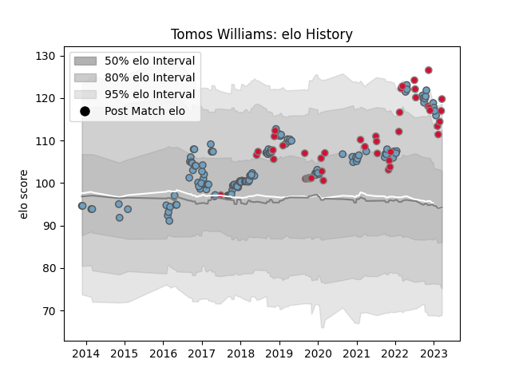

---  
layout: page  
title: Tomos Williams  
date: 2022-12-31 16:27:30.788352  
categories: player  
---
# Tomos Williams

## Positions: SH

## Country: Wales

## Current elo: 112.0

## Current Percentile: 88.0

# Elo History

# Match History

| Team          |   Appearances |   Win Rate |
|:--------------|--------------:|-----------:|
| Cardiff Blues |           126 |   0.531746 |
| Wales         |            41 |   0.52439  |

| Opponent           |   Matches |   Win Rate |
|:-------------------|----------:|-----------:|
| Scarlets           |        14 |   0.428571 |
| Dragons            |        11 |   1        |
| Ospreys            |        10 |   0.2      |
| Glasgow Warriors   |         9 |   0.111111 |
| Munster            |         8 |   0.5      |
| Leinster           |         7 |   0        |
| South Africa       |         7 |   0.428571 |
| Edinburgh          |         7 |   0.714286 |
| Zebre              |         6 |   0.666667 |
| Benetton Treviso   |         6 |   0.583333 |
| Connacht           |         6 |   0.5      |
| Ireland            |         5 |   0.2      |
| Pau                |         5 |   0.8      |
| France             |         5 |   0.4      |
| Ulster             |         5 |   0.5      |
| Lyon               |         4 |   1        |
| Australia          |         4 |   0.75     |
| Argentina          |         4 |   0.625    |
| Cheetahs           |         3 |   0.666667 |
| New Zealand        |         3 |   0        |
| Newcastle Falcons  |         3 |   1        |
| Stade Toulousain   |         3 |   0.666667 |
| Georgia            |         2 |   0.5      |
| Fiji               |         2 |   1        |
| England            |         2 |   0        |
| Gloucester Rugby   |         2 |   0.5      |
| Sale Sharks        |         2 |   0.5      |
| Bath Rugby         |         2 |   0.5      |
| Scotland           |         2 |   1        |
| Bristol Rugby      |         2 |   1        |
| Southern Kings     |         2 |   1        |
| Harlequins         |         2 |   0        |
| Worcester Warriors |         1 |   0        |
| Stormers           |         1 |   1        |
| Wasps              |         1 |   1        |
| Uruguay            |         1 |   1        |
| Tonga              |         1 |   1        |
| Bulls              |         1 |   0        |
| Sharks             |         1 |   1        |
| Italy              |         1 |   1        |
| Samoa              |         1 |   1        |
| Canada             |         1 |   1        |
| Leicester Tigers   |         1 |   0        |
| Lions              |         1 |   0        |