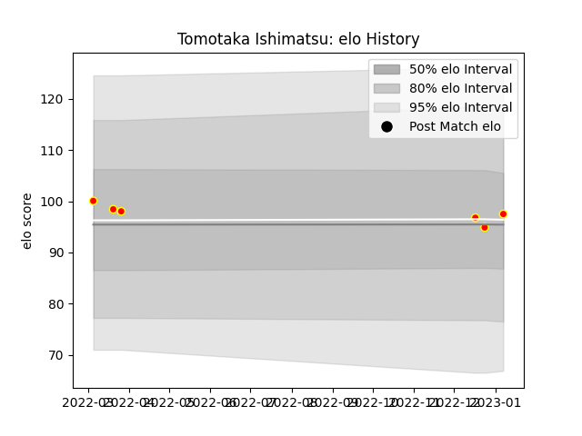

---  
layout: page  
title: Tomotaka Ishimatsu  
date: 2023-01-13 11:30:36.823889  
categories: player  
---
# Tomotaka Ishimatsu

## Positions: L

## Current elo: 98.0

## Current Percentile: 61.0

# Elo History

# Match History

| Team          |   Appearances |   Win Rate |
|:--------------|--------------:|-----------:|
| Kyuden Voltex |             6 |   0.333333 |

| Opponent                         |   Matches |   Win Rate |
|:---------------------------------|----------:|-----------:|
| Chugoku Red Regulions            |         1 |          1 |
| Kurita Water Gush                |         1 |          1 |
| Munakata Sanix Blues             |         1 |          0 |
| NTT Docomo Red Hurricanes Osaka  |         1 |          0 |
| Shimizu Blue Sharks              |         1 |          0 |
| Toyota Industries Shuttles Aichi |         1 |          0 |