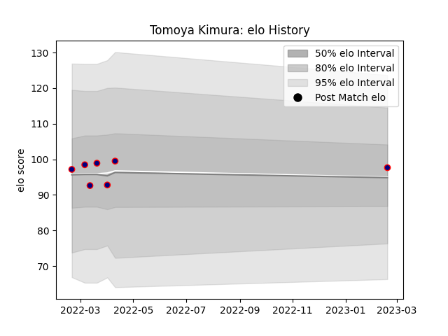

---  
layout: page  
title: Tomoya Kimura  
date: 2023-02-24 02:35:26.094554  
categories: player  
---
# Tomoya Kimura

## Positions: W, FB

## Current elo: 98.0

## Current Percentile: 62.0

# Elo History

# Match History

| Team                     |   Appearances |   Win Rate |
|:-------------------------|--------------:|-----------:|
| Hanazono Kintetsu Liners |             7 |   0.714286 |

| Opponent             |   Matches |   Win Rate |
|:---------------------|----------:|-----------:|
| Kamaishi Seawaves    |         2 |          1 |
| Hino Red Dolphins    |         1 |          1 |
| Mie Honda Heat       |         1 |          1 |
| Mitsubishi Dynaboars |         1 |          0 |
| Saitama Wild Knights |         1 |          0 |
| Skyactivs Hiroshima  |         1 |          1 |