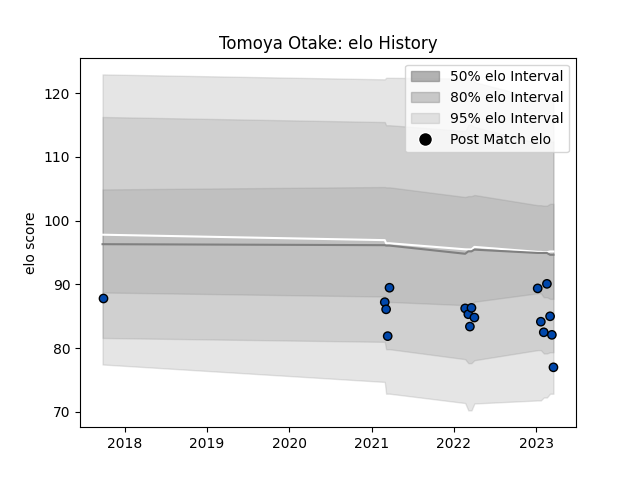

---  
layout: page  
title: Tomoya Otake  
date: 2023-01-13 11:31:41.482542  
categories: player  
---
# Tomoya Otake

## Positions: P

## Current elo: 75.0

## Current Percentile: 3.0

# Elo History

# Match History

| Team                |   Appearances |   Win Rate |
|:--------------------|--------------:|-----------:|
| Skyactivs Hiroshima |            10 |        0.2 |
| Mazda Blue Zoomers  |             1 |        0   |

| Opponent                         |   Matches |   Win Rate |
|:---------------------------------|----------:|-----------:|
| Chugoku Red Regulions            |         2 |        0.5 |
| Mie Honda Heat                   |         2 |        0   |
| Hanazono Kintetsu Liners         |         1 |        0   |
| Hino Red Dolphins                |         1 |        0   |
| Kamaishi Seawaves                |         1 |        1   |
| Kurita Water Gush                |         1 |        0   |
| Kyuden Voltex                    |         1 |        0   |
| Mitsubishi Dynaboars             |         1 |        0   |
| Toyota Industries Shuttles Aichi |         1 |        0   |