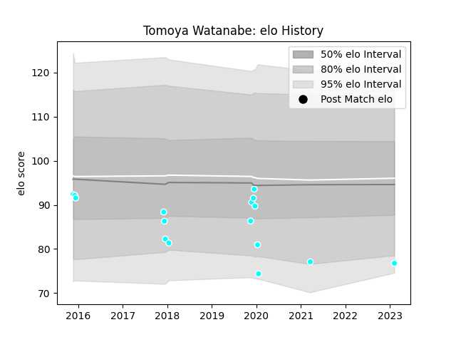

---  
layout: page  
title: Tomoya Watanabe  
date: 2023-02-09 13:55:35.868831  
categories: player  
---
# Tomoya Watanabe

## Positions: H

## Current elo: 77.0

## Current Percentile: None

# Elo History

# Match History

| Team                             |   Appearances |   Win Rate |
|:---------------------------------|--------------:|-----------:|
| Toyota Industries Shuttles Aichi |            16 |      0.375 |

| Opponent                          |   Matches |   Win Rate |
|:----------------------------------|----------:|-----------:|
| Yokohama Canon Eagles             |         2 |          0 |
| Black Rams Tokyo                  |         1 |          0 |
| Coca-Cola Red Sparks              |         1 |          0 |
| Hanazono Kintetsu Liners          |         1 |          0 |
| Kamaishi Seawaves                 |         1 |          1 |
| Kobelco Kobe Steelers             |         1 |          0 |
| Kubota Spears Funabashi Tokyo-Bay |         1 |          0 |
| Kurita Water Gush                 |         1 |          1 |
| Kyuden Voltex                     |         1 |          1 |
| Mazda Blue Zoomers                |         1 |          1 |
| Mie Honda Heat                    |         1 |          0 |
| NTT Docomo Red Hurricanes Osaka   |         1 |          0 |
| Shimizu Blue Sharks               |         1 |          1 |
| Shizuoka Blue Revs                |         1 |          0 |
| Skyactivs Hiroshima               |         1 |          1 |