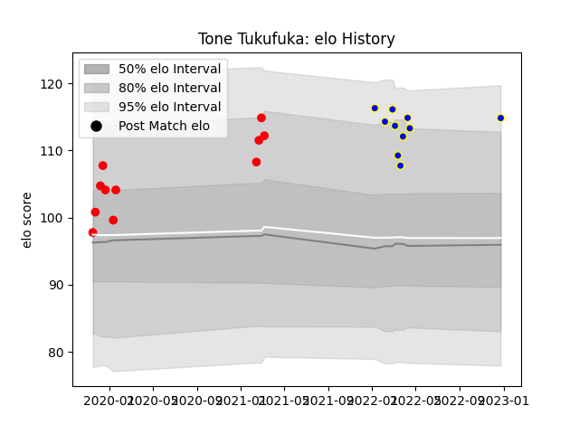

---  
layout: page  
title: Tone Tukufuka  
date: 2023-03-21 18:42:57.463144  
categories: player  
---
# Tone Tukufuka

Last updated: 2023-03-21
## Positions: C

## Current elo: 146.0

## Current Percentile: 99.0

# Elo History

# Match History

| Team                 |   Appearances |   Win Rate |
|:---------------------|--------------:|-----------:|
| Urayasu D-Rocks      |            16 |   0.625    |
| Coca-Cola Red Sparks |            14 |   0.678571 |

| Opponent                         |   Matches |   Win Rate |
|:---------------------------------|----------:|-----------:|
| Toyota Industries Shuttles Aichi |         4 |   0.75     |
| Shimizu Blue Sharks              |         4 |   1        |
| Kamaishi Seawaves                |         3 |   0.833333 |
| Hanazono Kintetsu Liners         |         2 |   0        |
| Kyuden Voltex                    |         2 |   1        |
| Saitama Wild Knights             |         2 |   0        |
| Black Rams Tokyo                 |         1 |   1        |
| Shizuoka Blue Revs               |         1 |   0        |
| Toyota Verblitz                  |         1 |   0        |
| Toshiba Brave Lupus Tokyo        |         1 |   1        |
| Tokyo Sungoliath                 |         1 |   0        |
| Skyactivs Hiroshima              |         1 |   1        |
| Mitsubishi Dynaboars             |         1 |   0        |
| Chugoku Red Regulions            |         1 |   1        |
| Mazda Blue Zoomers               |         1 |   1        |
| Kurita Water Gush                |         1 |   1        |
| Kobelco Kobe Steelers            |         1 |   1        |
| Hino Red Dolphins                |         1 |   1        |
| Yokohama Canon Eagles            |         1 |   0        |