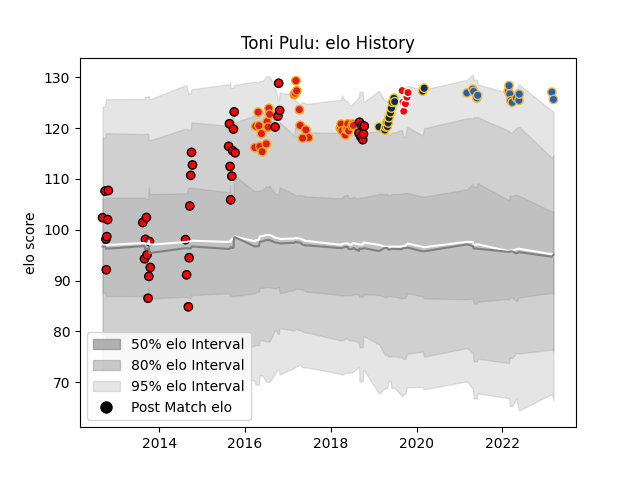

---  
layout: page  
title: Toni Pulu  
date: 2023-03-02 11:22:47.079642  
categories: player  
---
# Toni Pulu

## Positions: W

## Country: Chiefs

## Current elo: 127.0

## Current Percentile: 93.0

# Elo History

# Match History

| Team             |   Appearances |   Win Rate |
|:-----------------|--------------:|-----------:|
| Counties Manukau |            44 |   0.465909 |
| Chiefs           |            32 |   0.71875  |
| Brumbies         |            14 |   0.714286 |
| Western Force    |            13 |   0.307692 |
| Canberra Vikings |             6 |   0.833333 |

| Opponent                 |   Matches |   Win Rate |
|:-------------------------|----------:|-----------:|
| Canterbury               |         6 |   0.166667 |
| New South Wales Waratahs |         6 |   0.666667 |
| Hurricanes               |         5 |   0.6      |
| Highlanders              |         5 |   0.6      |
| Brumbies                 |         5 |   0.4      |
| Tasman                   |         5 |   0.4      |
| Taranaki                 |         5 |   0.3      |
| Melbourne Rebels         |         4 |   0.75     |
| Crusaders                |         4 |   0.25     |
| Queensland Reds          |         4 |   0.75     |
| Stormers                 |         4 |   0.75     |
| Sunwolves                |         4 |   1        |
| Waikato                  |         4 |   0.5      |
| Wellington               |         4 |   0.25     |
| Blues                    |         4 |   0.75     |
| Hawke's Bay              |         3 |   0.666667 |
| Jaguares                 |         3 |   0        |
| Southland                |         3 |   1        |
| Sharks                   |         3 |   0.666667 |
| Otago                    |         3 |   1        |
| Northland                |         3 |   0.666667 |
| North Harbour            |         2 |   0        |
| Auckland                 |         2 |   0        |
| Bay of Plenty            |         2 |   1        |
| Manawatu                 |         2 |   0.5      |
| Fijian Drua              |         2 |   1        |
| Chiefs                   |         2 |   0.5      |
| NSW Country Eagles       |         1 |   1        |
| Moana Pasifika           |         1 |   1        |
| Melbourne Rising         |         1 |   1        |
| Queensland Country       |         1 |   0        |
| Lions                    |         1 |   1        |
| Cheetahs                 |         1 |   1        |
| Bulls                    |         1 |   1        |
| British and Irish Lions  |         1 |   0        |
| Brisbane City            |         1 |   1        |
| Western Force            |         1 |   1        |